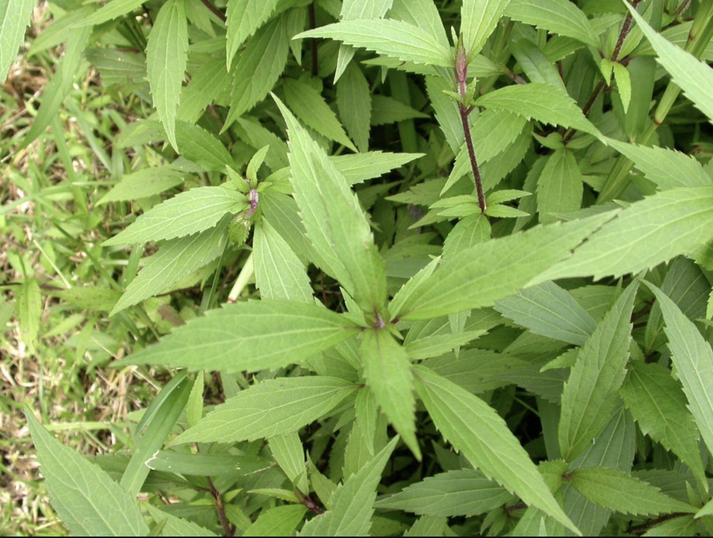
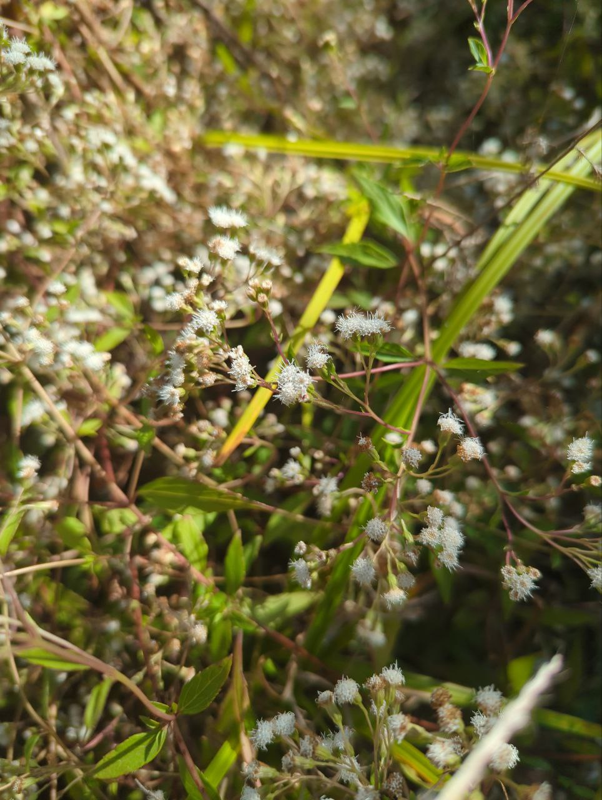

alias:: mistflower
tags:: species
- 
- 
- Studies have suggested antimicrobial, wound healing, hemostatic, antioxidant, anti inflammatory, platelet protective, anticancer, anti-anemic properties.
- In Indonesia, young leaves are used to treat wounds.
- In many tropical countries, it is used to stop bleeding and wound healing.
- In Vietnam, aqueous extract of leaves is used for the treatment of soft tissue wounds, burns wounds and skin infections.
- In Nigeria, it is used for wound healings and as anthelmintic, also used for treatment of piles.
- In the Philippines, crushed leaves are used for "kulebra", bolis and tumorous inflammtory conditions.
- In Java and Sri Lanka, it is used for its strong antifungal properties.
- in Northeast India, it is used as traditional medicine by boiling the whole plant and drinking the juice, indigenous people believe it can prevent disease caused by germs.
- [[plant/roles]]
	- [[attractor]]
	- [[repeller]]
	- [[health]]
	-