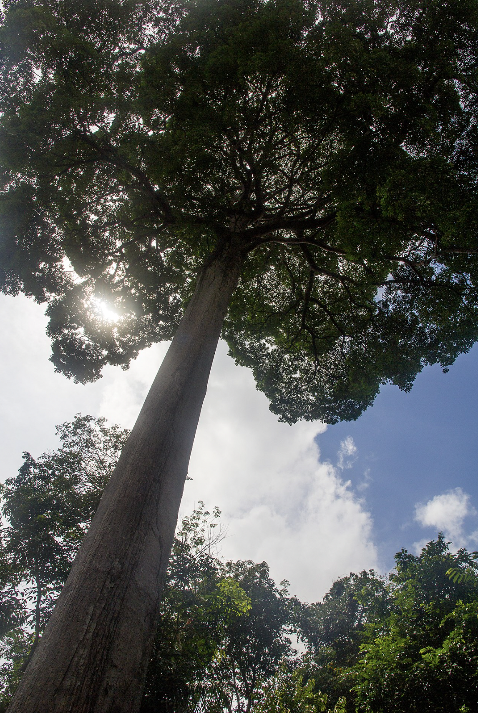
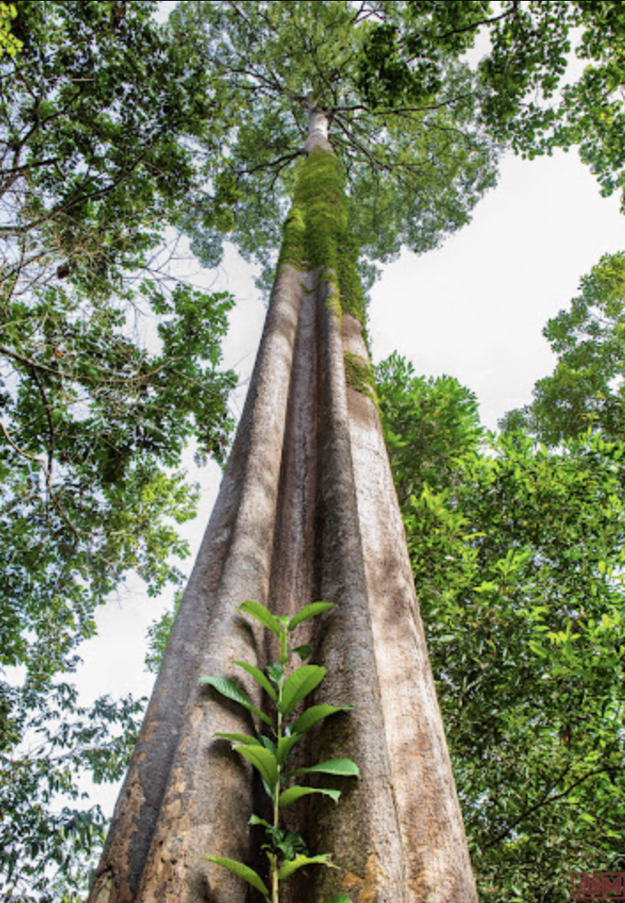

tags:: species
alias:: pulai hitam

- availability:: hanara, [tokopedia](https://www.tokopedia.com/hanaranurseries/alstonia-angustiloba-pulai-hitam-pohon-instan-instant-tree?extParam=ivf%3Dfalse%26src%3Dsearch)
- up to 45 m
- 
- 
- 
-
- [tokopedia](https://www.tokopedia.com/hanaranurseries/alstonia-angustiloba-pulai-hitam-pohon-instan-instant-tree?extParam=ivf%3Dfalse%26src%3Dsearch)