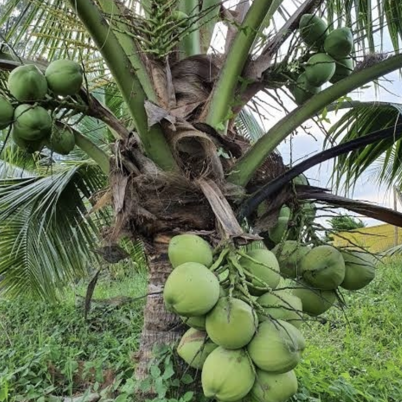

alias:: coconut
tags:: species
- 
- [tokopedia](https://www.tokopedia.com/pusatgrosirb/bibit-tanaman-kelapa-genjah-entok?extParam=ivf%3Dfalse&src=topads)
- dwarf variation needed
- https://www.fruitrop.com/en/Articles-by-subject/Agronomy/2011/Coconut-cultivation
-