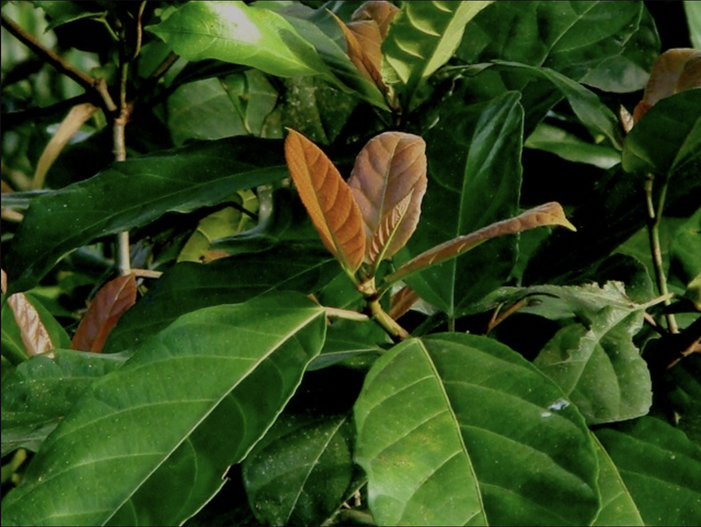

tags:: species
alias:: benying
- availability:: tokopedia
- To estimate the yield of ficusin (psoralen) from *Ficus fistulosa* in terms of financial value per hectare per year, we need to consider several factors, including the average concentration of ficusin in the leaves, the biomass production per hectare, and the current market price for psoralen.
- ### Steps for Estimation
  
  1. **Biomass Production**
	- Estimate the leaf biomass yield per hectare per year for mature *Ficus fistulosa* trees.
	  
	  2. **Ficusin Concentration**
	- Determine the average concentration of ficusin in the leaves of *Ficus fistulosa*.
	  
	  3. **Extraction Efficiency**
	- Consider the efficiency of extracting ficusin from the leaves.
	  
	  4. **Market Price**
	- Find the current market price for purified psoralen (ficusin).
- ### Assumptions and Estimates
- #### 1. Biomass Production
- Average leaf biomass yield per mature *Ficus fistulosa* tree: 20 kg/tree/year
- Number of trees per hectare: 400 (assuming a spacing of 5 x 5 meters)
- Total leaf biomass per hectare per year: 20 kg/tree/year * 400 trees = 8,000 kg/year
- #### 2. Ficusin Concentration
- Average concentration of ficusin in the leaves: 0.5% (or 5 grams per kilogram of leaves)
- #### 3. Extraction Efficiency
- Efficiency of ficusin extraction: 50%
- #### 4. Market Price
- Current market price for purified psoralen: $1,000 per kilogram
- ### Calculations
  
  1. **Total Ficusin Content in Leaves**
	- Total ficusin in 8,000 kg of leaves: 8,000 kg * 0.5% = 40 kg
	  
	  2. **Extractable Ficusin**
	- Extractable ficusin (50% extraction efficiency): 40 kg * 50% = 20 kg
	  
	  3. **Market Value**
	- Market value of extracted ficusin: 20 kg * $1,000/kg = $20,000
- ### Estimated Yield of Ficusin from 1 Hectare of Mature Trees per Year
- **Total Yield**: 20 kg of ficusin
- **Financial Value**: $20,000 per hectare per year
- ### Conclusion
  From 1 hectare of mature *Ficus fistulosa* trees, the estimated yield of ficusin (psoralen) is approximately 20 kg per year, with a financial value of around $20,000, assuming the current market price of $1,000 per kilogram for purified psoralen.
- , wild fig
- 
- anti [[hiv]]
	- chloroform fraction from ficus fistulosa leaves
	- shows effective anti-viral activity against mt4/hiv cells
	- has the potential to act as anti hiv-1 in vitro