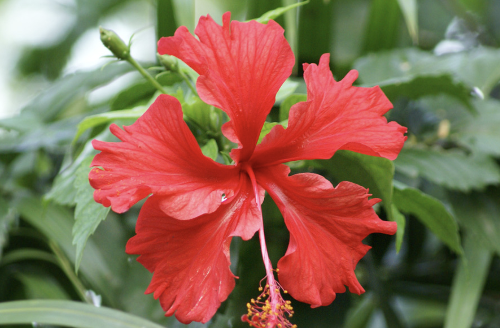

tags:: species
alias:: archers hibiscus, red hibiscus,

- 
- http://www.plantsofasia.com/index/hibiscus_x_archeri/0-793
- https://www.tokopedia.com/canaira/bibit-tanaman-hias-hibiscus-varigata-red?extParam=ivf%3Dfalse
- https://en.wikipedia.org/wiki/List_of_Hibiscus_cultivars
-