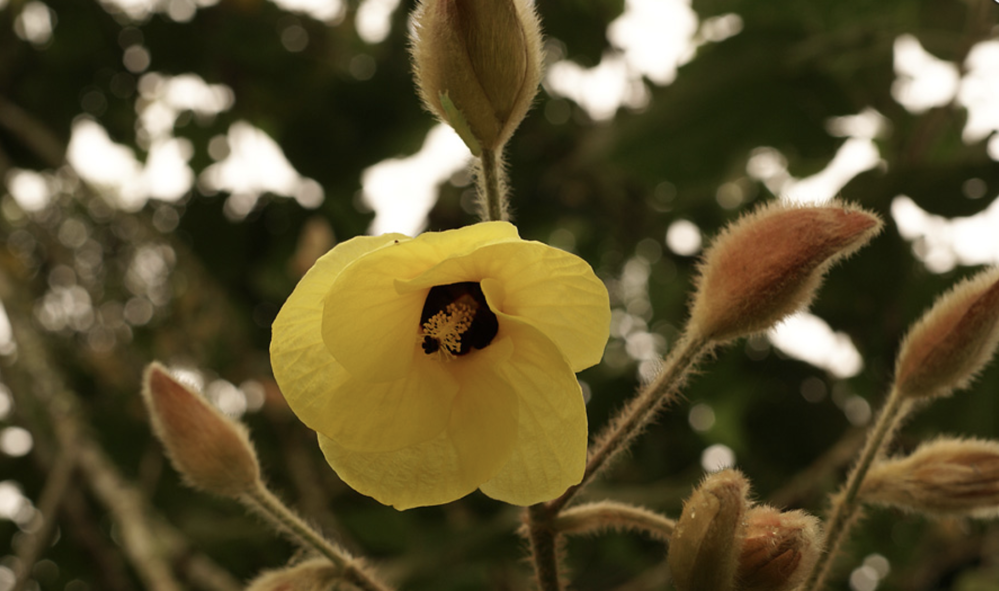
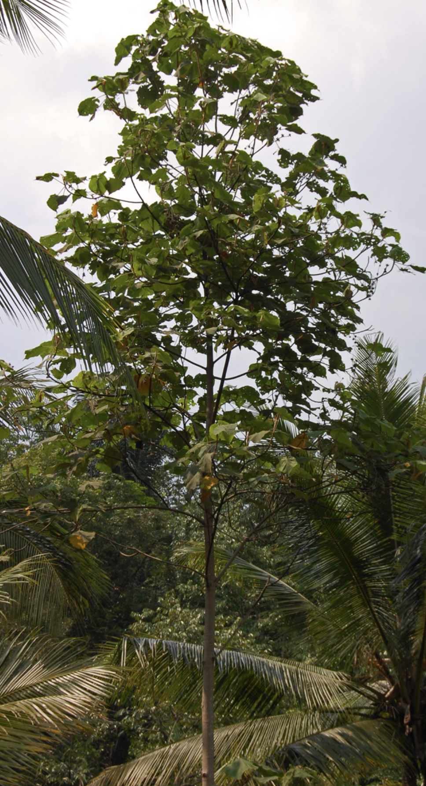

tags:: species
alias:: large-leaved hibiscus, baru kesi

- 
- 
- http://www.plantsofasia.com/index/hibiscus_macrophyllus/0-419
- https://www.tokopedia.com/akhtarpe/bibit-waru-gunung-waru-tisuk-hibiscus-elatus-bibit-daun-waru?extParam=ivf%3Dfalse%26src%3Dsearch&refined=true
- https://en.wikipedia.org/wiki/Hibiscus_macrophyllus
-