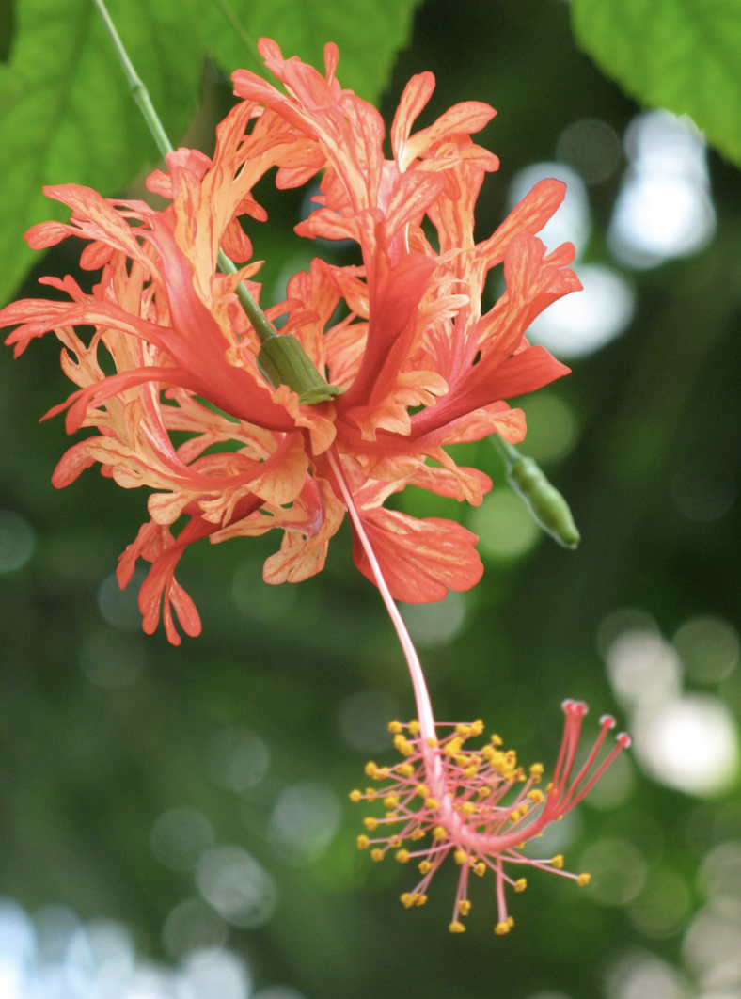

tags:: species
alias:: coral hibiscus, spider hibiscus

- 
- 
- http://www.plantsofasia.com/index/hibiscus_schizopetalus/0-791
- https://www.tokopedia.com/cihoroku/hibiscus-schizopetalus?extParam=ivf%3Dfalse&src=topads
- https://en.wikipedia.org/wiki/Hibiscus_schizopetalus
- height: 3m
-