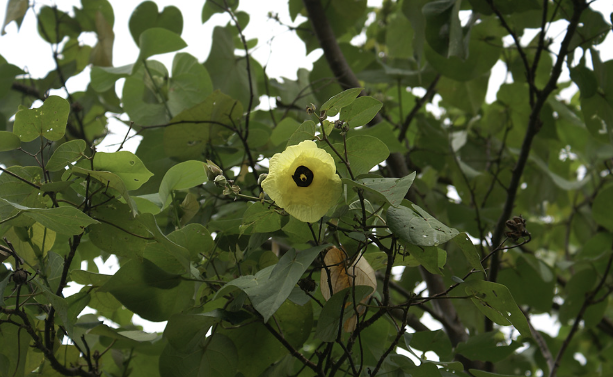

tags:: species
alias:: beach hibiscus, green cottonwood

- 
- http://www.plantsofasia.com/index/hibiscus_tiliaceus/0-418
- https://www.tokopedia.com/daunkreasi/waru-varigata-hibiscus-tiliaceus-cantik-remaja?extParam=ivf%3Dfalse%26src%3Dsearch
- https://en.wikipedia.org/wiki/Hibiscus_tiliaceus
- height: 4-10m
-