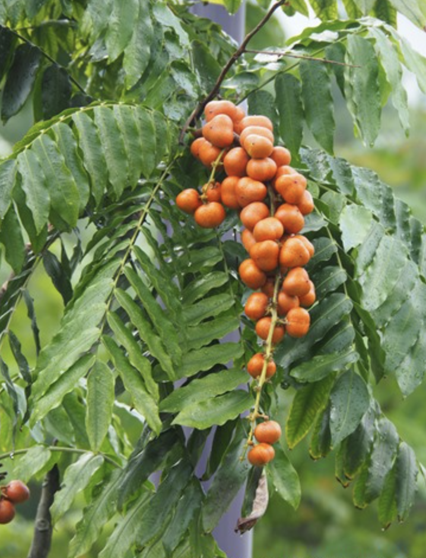

tags:: species

- 
- height: 3-6m
- https://toptropicals.com/catalog/uid/lepisanthes_amoena.htm#:~:text=Lepisanthes%20amoena%20is%20a%20small,10%2D20%20feet%20in%20height.
- https://www.tokopedia.com/erlitagaluh/bibit-pohon-buah-exotic-lepisanthes-amoena-langka?extParam=ivf%3Dfalse%26src%3Dsearch
-