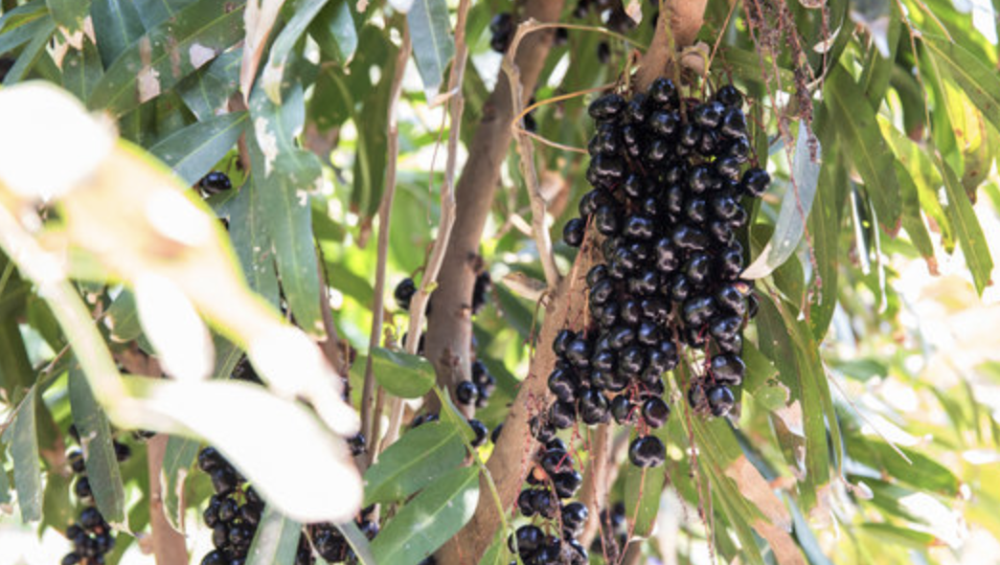

tags:: species

- 
- height: up to 14 m
- https://asianplant.net/Sapindaceae/Lepisanthes_fruticosa.htm
- https://www.tokopedia.com/tokoramai10-1/promo-tanaman-katilayu-atau-kilalayu-lepisanthes-fruticosa-unik-langka?extParam=ivf%3Dfalse%26src%3Dsearch
-