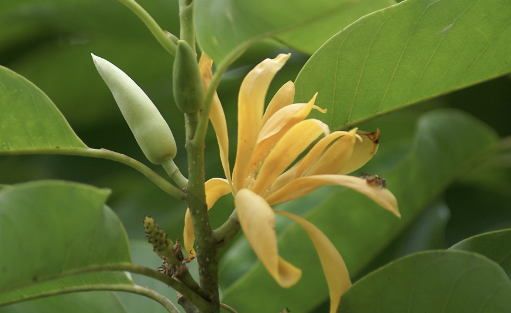
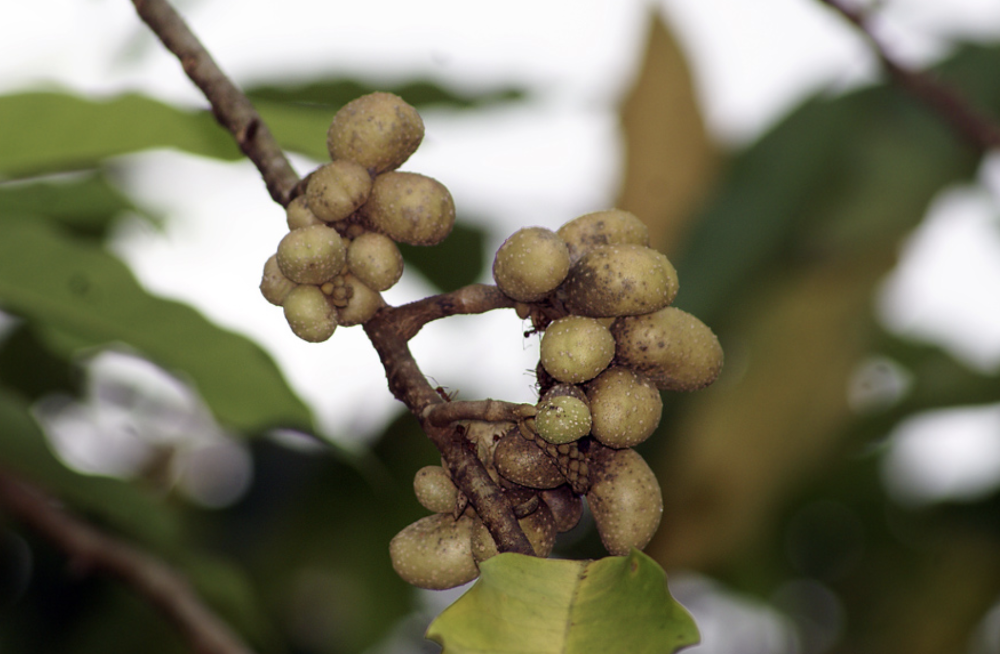

tags:: species
alias:: champaсa

- 
- 
- 
- height: 50 m
- https://en.wikipedia.org/wiki/Magnolia_champaca
- http://www.plantsofasia.com/index/magnolia_champaca/0-516
- https://www.tokopedia.com/rocketfieldplantary/tanaman-bunga-cempaka-putih-white-magnolia-flowers-magnolia-champaca?extParam=ivf%3Dfalse%26src%3Dsearch
-