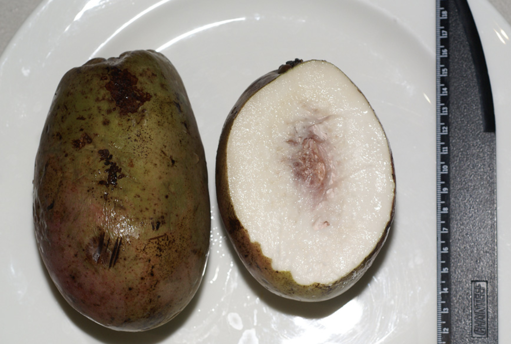
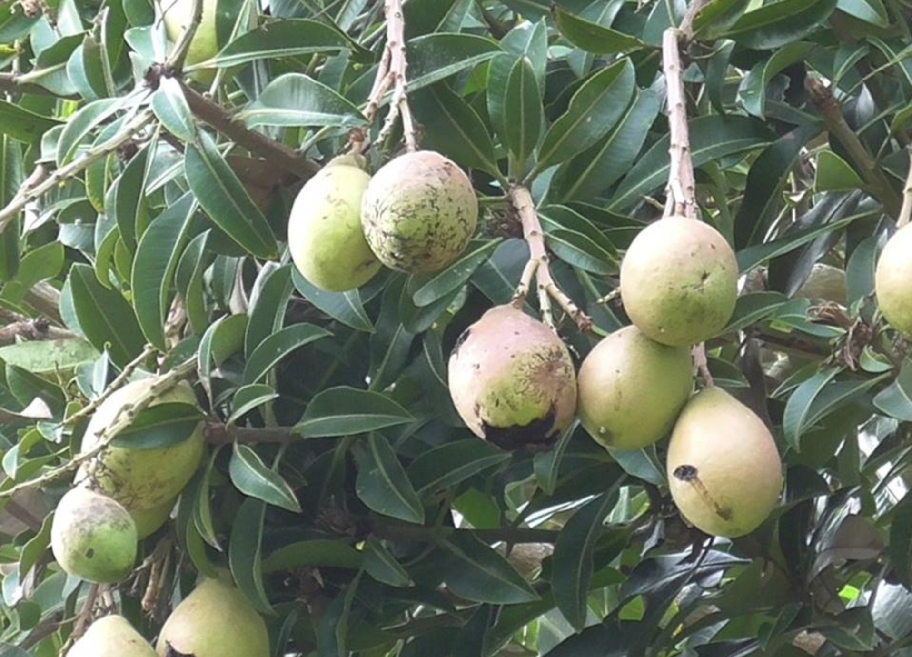

tags:: species
alias: wani, binjai, malaysian mango, white mango

-
- 
- 
- 
- 
- height: 30m
- https://en.wikipedia.org/wiki/Mangifera_caesia
- http://www.plantsofasia.com/index/mangifera_caesia/0-480
- https://www.tokopedia.com/nartood/bibit-buah-mangga-wani-manis-langka-non-biji?extParam=ivf%3Dfalse%26src%3Dsearch&refined=true
-