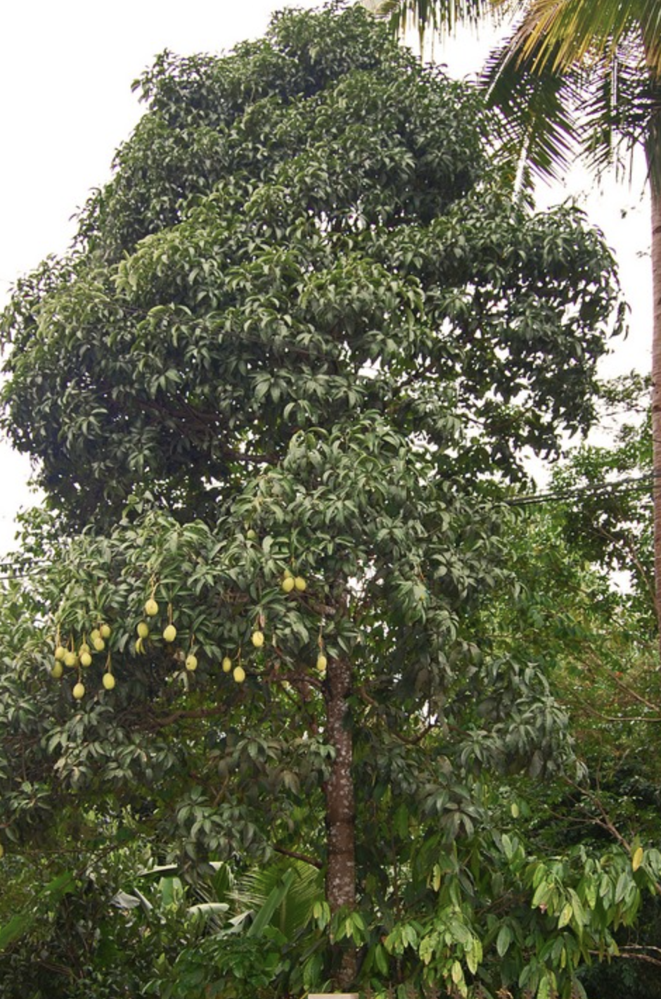

tags:: species
alias:: kuwini

- 
- 
-
- 
- height: 10-15m
- http://www.plantsofasia.com/index/mangifera_odorata/0-636
- https://en.wikipedia.org/wiki/Mangifera_odorata
- https://www.tokopedia.com/bibitmuraah/bibit-tanaman-buah-mangga-kweni-kuweni-mangifera-odorata?extParam=ivf%3Dfalse%26src%3Dsearch
-