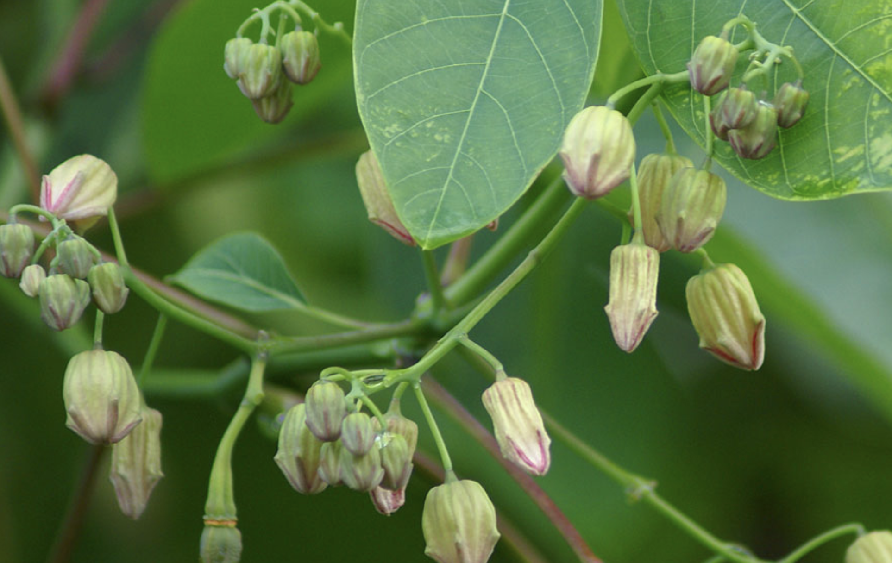

tags:: species
alias:: cеара rubber tree, singkong karet

- 
- 
- do not confuse with [[manihot esculenta]]
- height: up to 10m
- https://en.wikipedia.org/wiki/Manihot_carthaginensis_subsp._glaziovii
- http://www.plantsofasia.com/index/manihot_glaziovii/0-779
- https://www.tokopedia.com/widjayastore-3/bibit-stek-singkong-karet-singkong-taun?extParam=ivf%3Dfalse%26src%3Dsearch
-