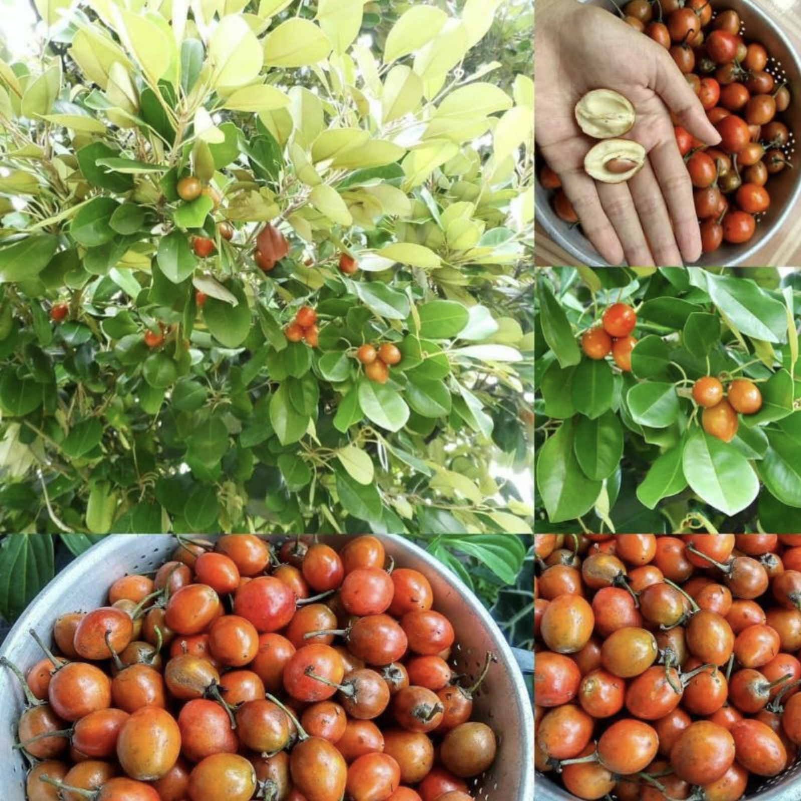
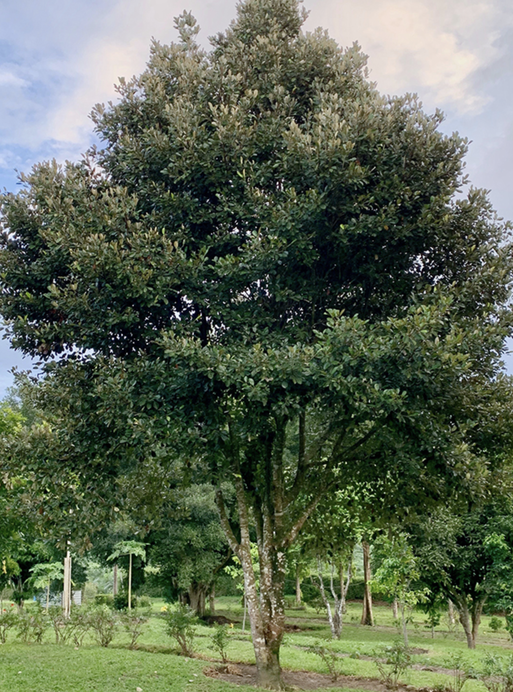

tags:: species
alias:: sawo kecik, caqui

- 
- 
- 
- 
- height: up to 25 m
- https://en.wikipedia.org/wiki/Manilkara_kauki
- http://www.plantsofasia.com/index/manilkara_kauki/0-755
- https://www.tokopedia.com/aqilaflora/pohon-sawo-kecik-saho-kecik-tinggi-2-meter?extParam=ivf%3Dfalse%26src%3Dsearch
-