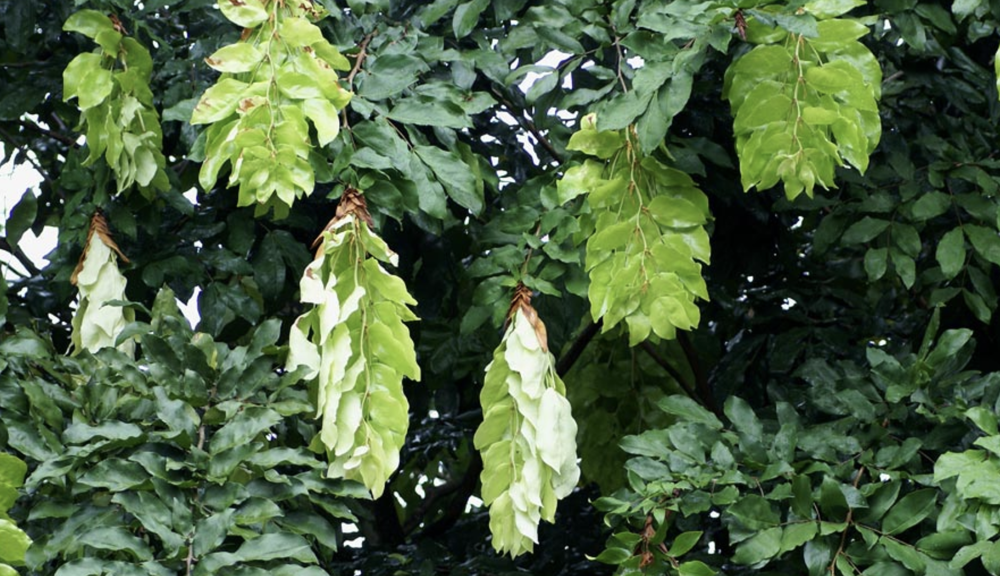
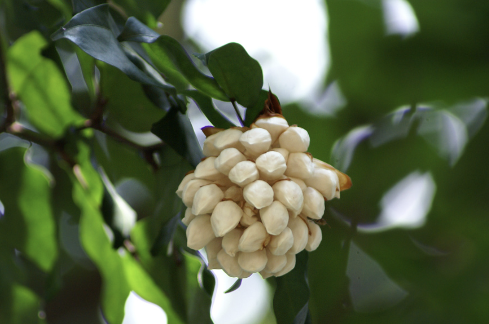
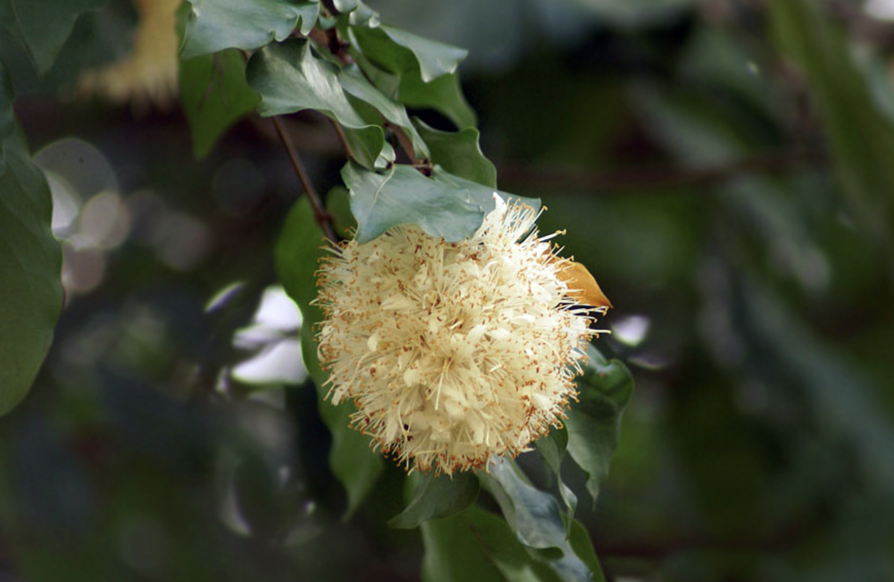
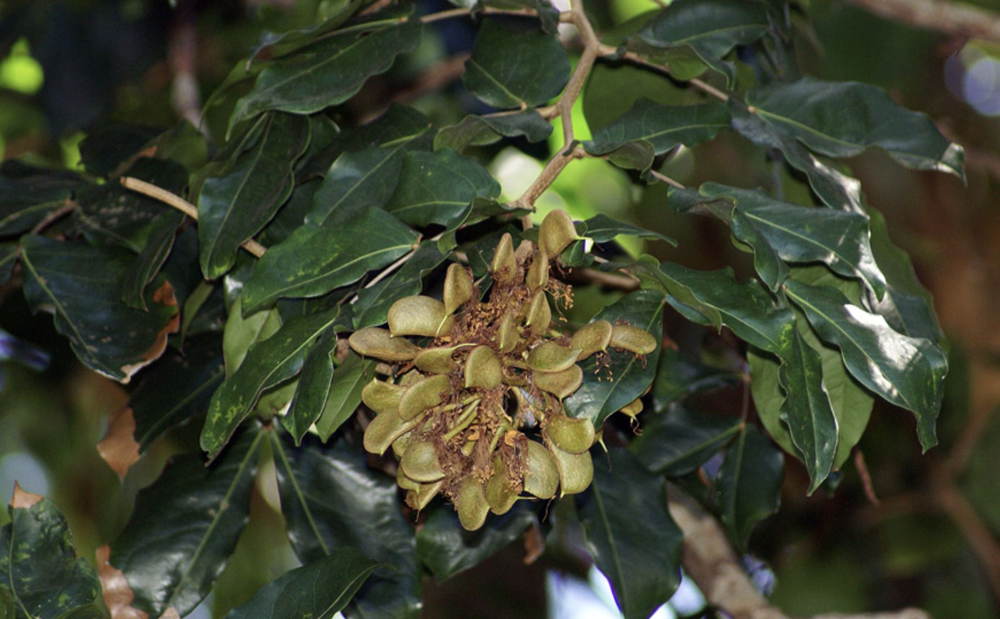

tags:: species
alias:: hankerchief tree, sapu tangan

- 
- 
- 
- 
- 
- height: 5-15m
- https://en.wikipedia.org/wiki/Cynometra_browneoides
- http://www.plantsofasia.com/index/maniltoa_browneoides/0-295
- https://www.tokopedia.com/garasipott/bibit-pohon-sapu-tangan-maniltoa-browneoides?extParam=ivf%3Dfalse%26src%3Dsearch
-
-