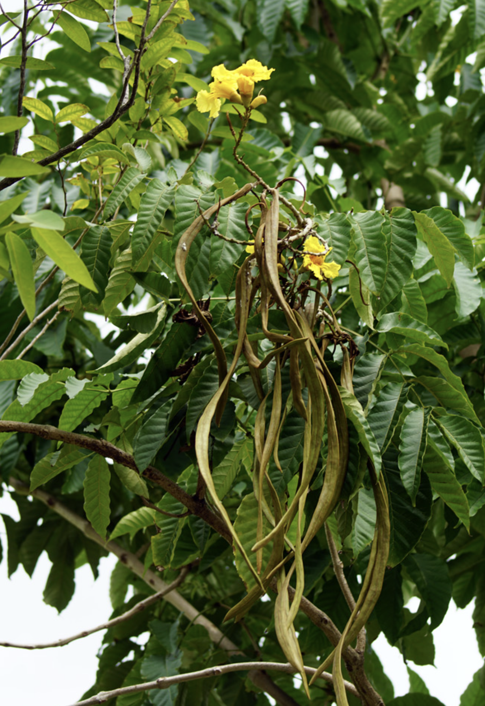
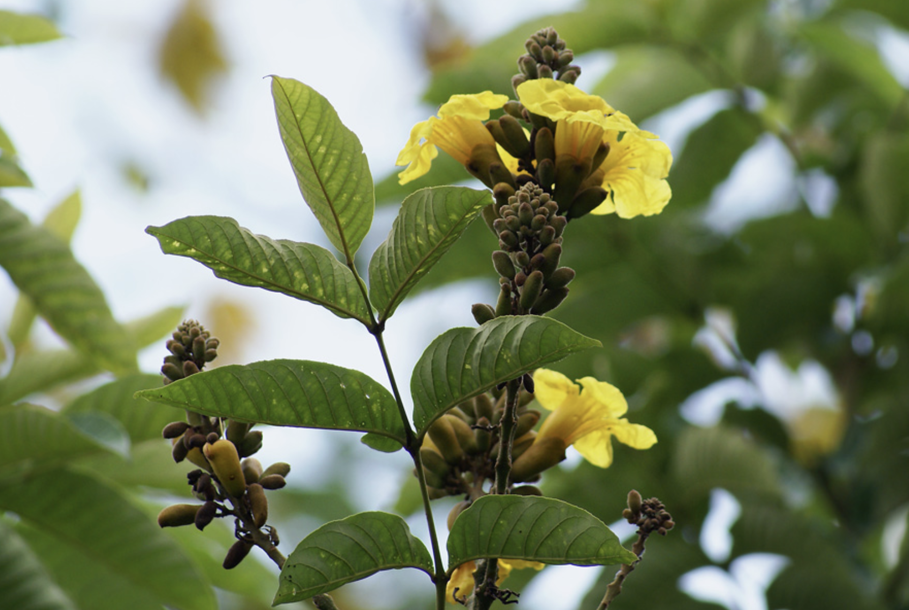
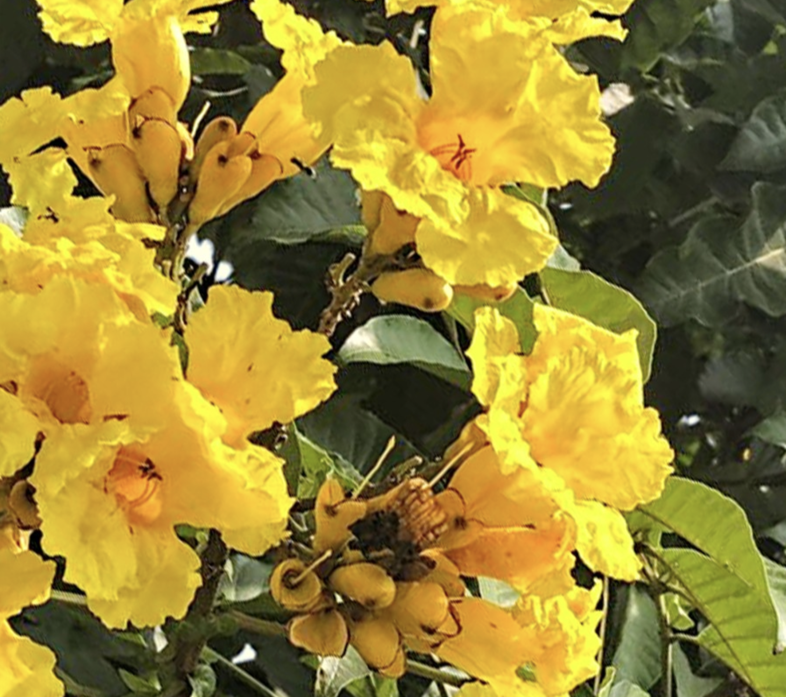

tags:: species
alias:: gold markhamia, yellow bell bean tree

- availability:: hanara
- 
- 
- height: 4-5 m
- https://en.wikipedia.org/wiki/Markhamia_lutea
- 
- 
- http://www.plantsofasia.com/index/markhamia_lutea/0-847
- https://www.tokopedia.com/hanaranurseries/markhamia-lutea-markhamia-pohon-instan-instant-tree?extParam=ivf%3Dfalse%26src%3Dsearch
-