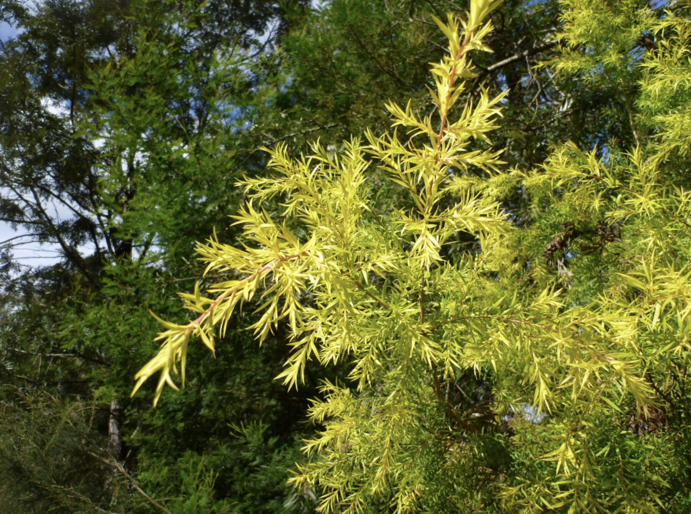

tags:: species
alias:: tea tree

- availability:: hanara
- 
- 
- 
- 
- 
- height: 7m
- https://en.wikipedia.org/wiki/Melaleuca_alternifolia
- https://www.tokopedia.com/tokojayaswalayan/melaleuca-alternifolia-tea-tree-narrow-leaved-paperbark?extParam=ivf%3Dfalse%26src%3Dsearch
-