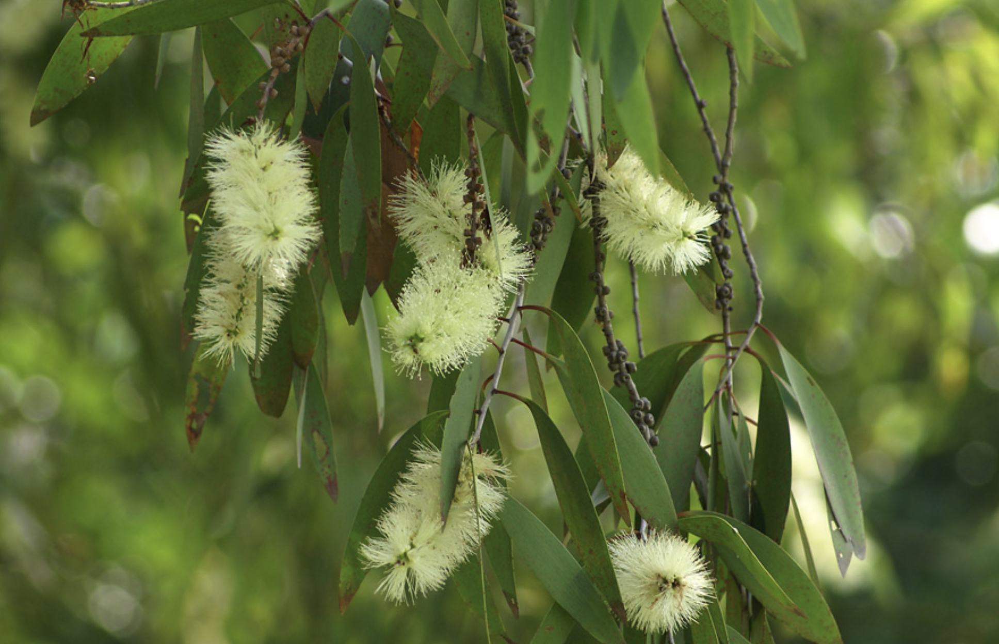

tags:: species
alias:: swamp tea-tree, white wood, kayu putih

- 
- 
- height: up to 35 m
- https://en.wikipedia.org/wiki/Melaleuca_cajuputi
- http://www.plantsofasia.com/index/melaleuca_cajuputi/0-1129
- https://www.tokopedia.com/pbcareshop/tanaman-obat-herbal-pohon-minyak-kayu-putih-melaleuca-cajuputi?extParam=ivf%3Dfalse
-