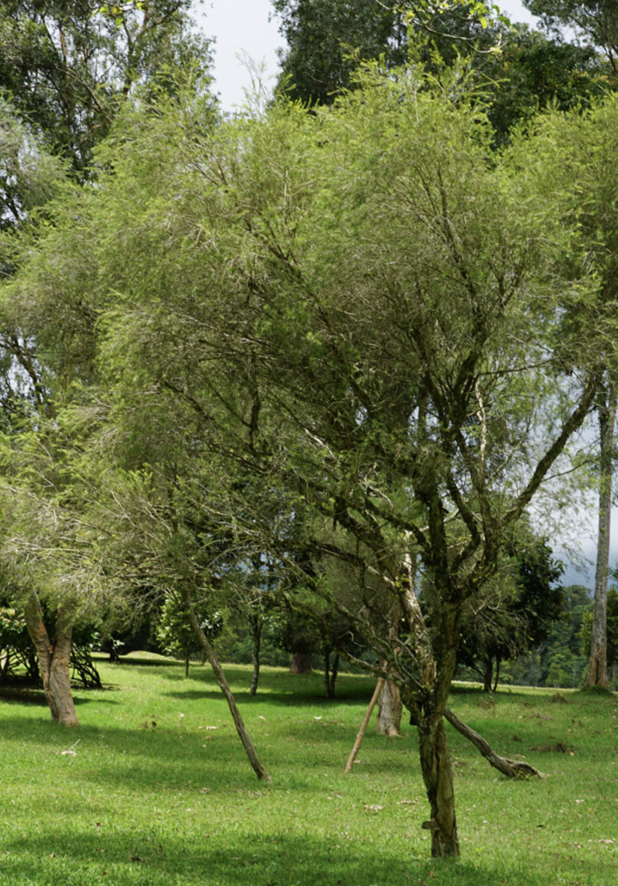
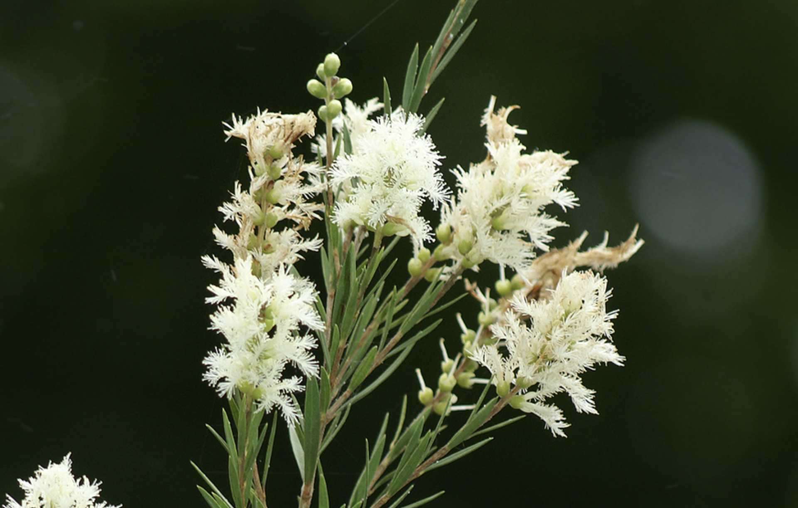
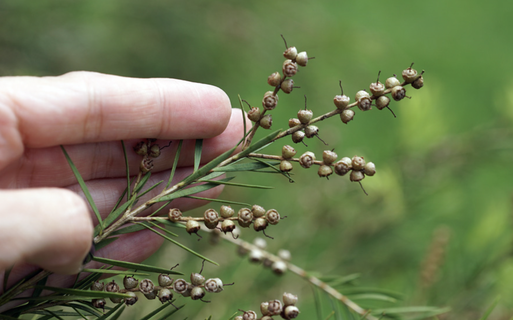

tags:: species
alias:: snow-in-summer

- 
- 
- 
- 
- height: 6-10m
- https://en.wikipedia.org/wiki/Melaleuca_linariifolia
- http://www.plantsofasia.com/index/melaleuca_linariifolia/0-1135
- https://www.tokopedia.com/muslaques/snow-in-summer-melaleuca-linariifolia-australian-paper-barked-shrub-with-fragrant-leaves-in-pot-of-24cm-diameter?extParam=ivf%3Dfalse%26src%3Dsearch
-
-