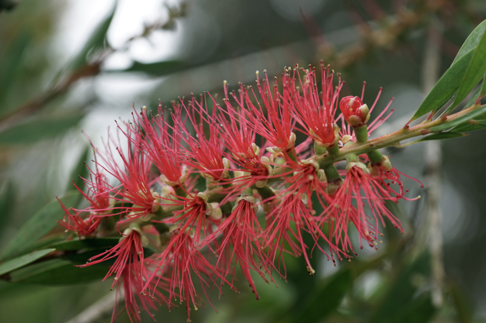

tags:: species
alias:: wallum bottlebrush

- 
- 
- height: 3 m
- https://en.wikipedia.org/wiki/Melaleuca_pachyphylla
- http://www.plantsofasia.com/index/melaleuca_pachyphylla/0-1132
- availiable in bali botanic garden
-
-