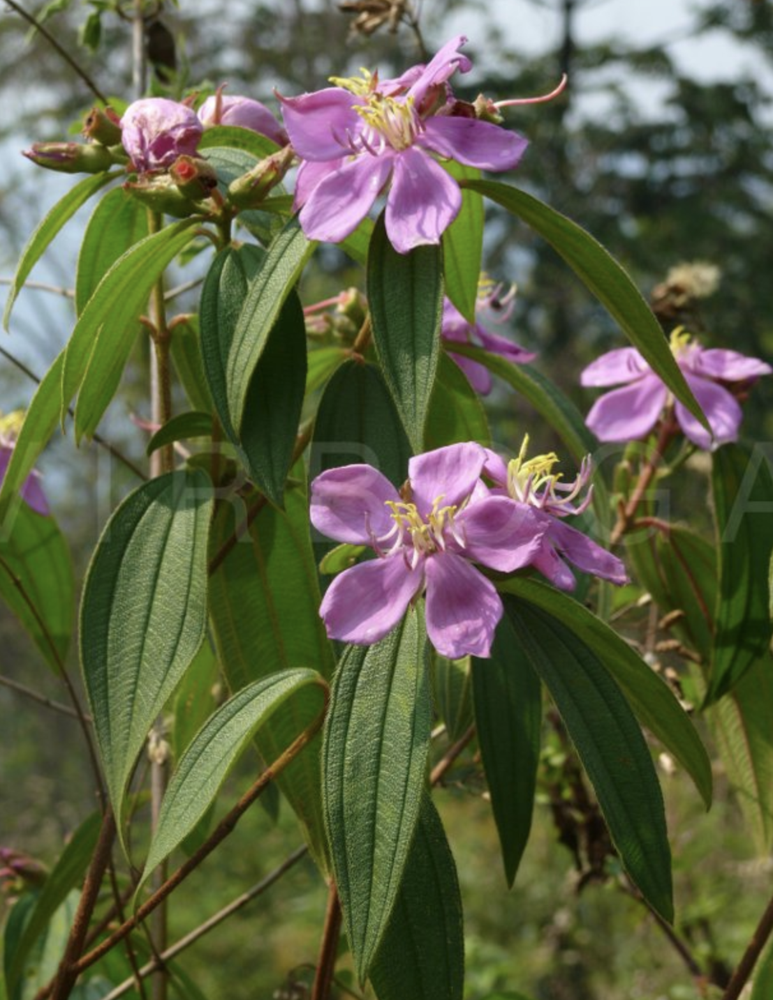
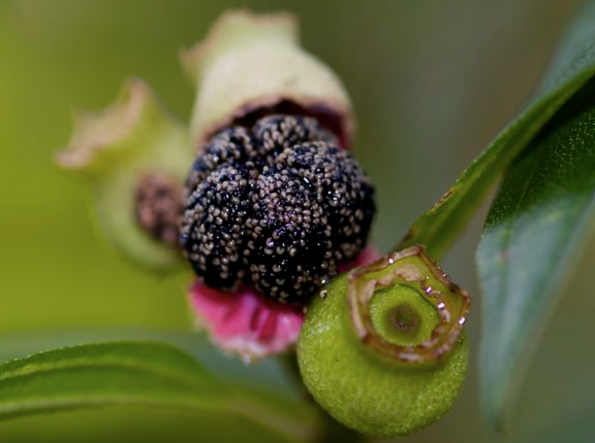

tags:: species
alias:: melastoma, senduduk

- 
- 
- 
- 
- [[plant/roles]]
	- [[aluminum]] [[hyperaccumulator]]
	- [[food]]
		- fruits
		- leaves
	- [[health]]
	- [[attractor]]
	- [[pioneer]]
- https://www.ncbi.nlm.nih.gov/pmc/articles/PMC3254175/
- height: up to 5m
- http://www.plantsofasia.com/index/melastoma_malabathricum/0-612
- https://en.wikipedia.org/wiki/Melastoma_malabathricum
-