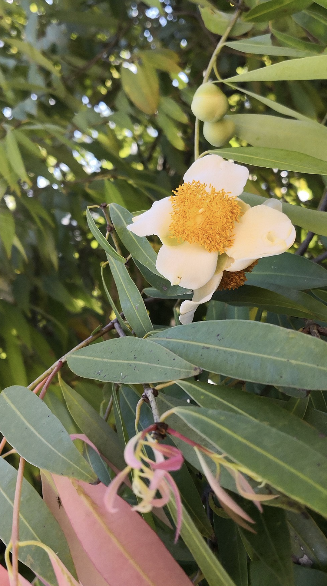
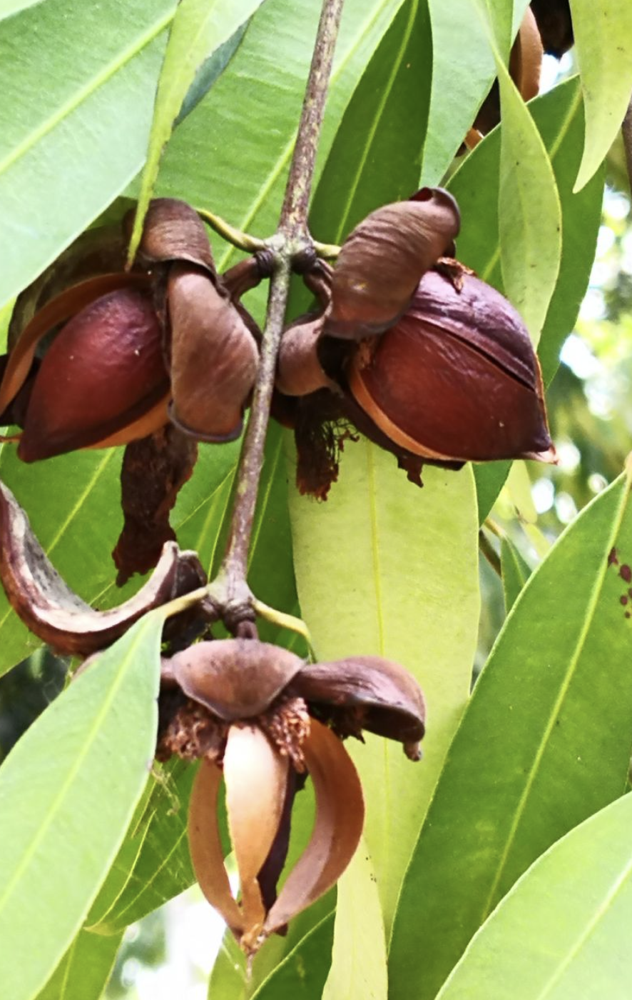

tags:: species
alias:: rose chestnut, poached egg tree, nagasari

- 
- 
- 
- height: 30m
- https://en.wikipedia.org/wiki/Mesua_ferrea
- http://www.plantsofasia.com/index/mesua_ferrea/0-1296
- https://www.tokopedia.com/g-grow/bibit-pohon-nagasari-ceylon-ironwood-cobra-saffron-mesua-ferrea?extParam=ivf%3Dfalse%26src%3Dsearch
-
-