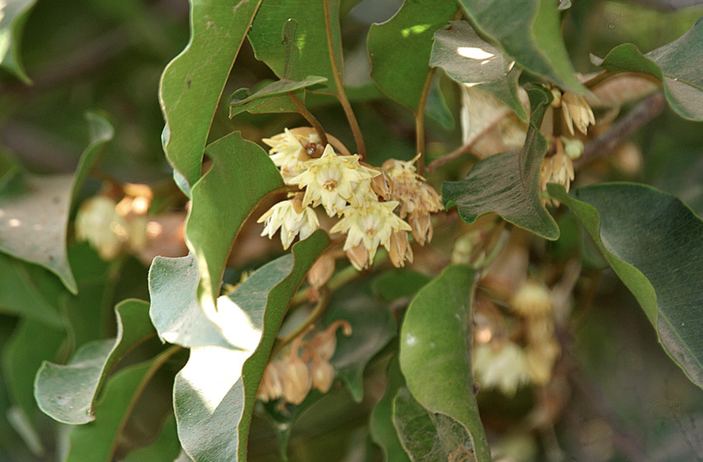
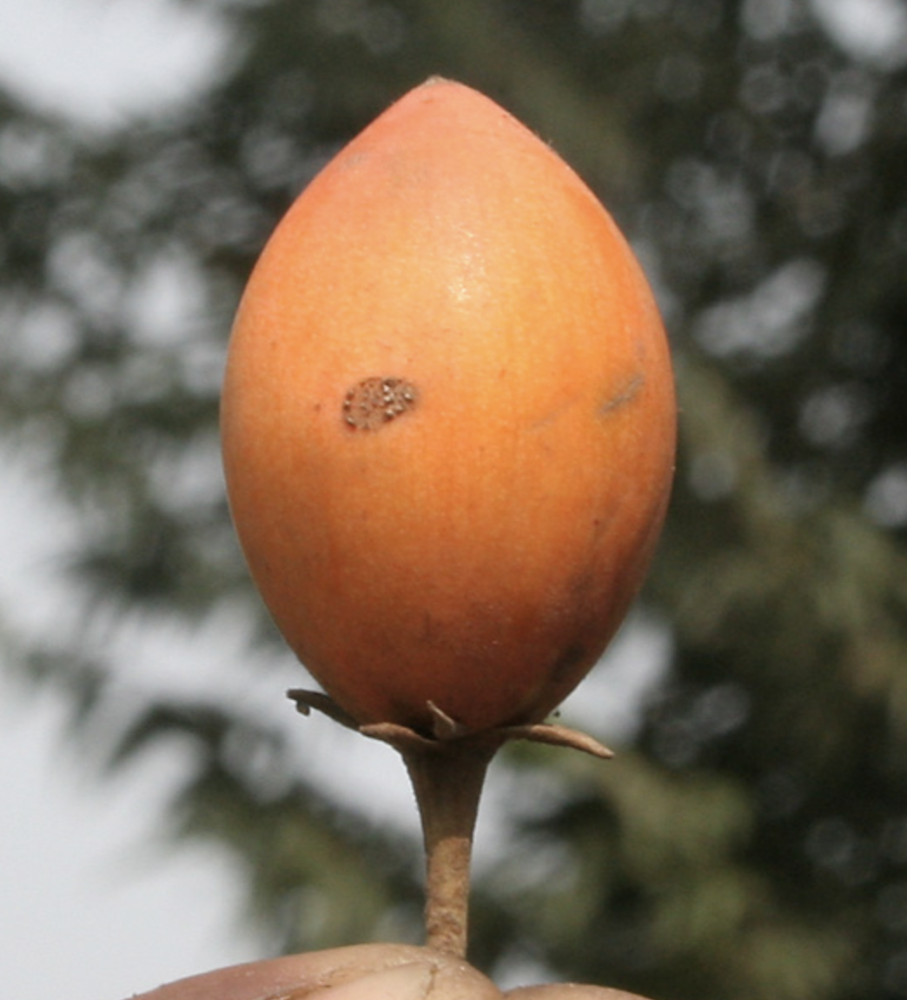

tags:: species
alias:: medlar, tanjang tree

- {:height 760, :width 1010}
- 
- 
- height: up to 16 m
- https://en.wikipedia.org/wiki/Mimusops_elengi
- https://www.tokopedia.com/ghazalitoko/2-butir-biji-benih-kahekis-karikis-kariskis-rekes-mimusops-elengi?extParam=ivf%3Dfalse%26src%3Dsearch
- http://www.plantsofasia.com/index/mimusops_elengi/0-601
-