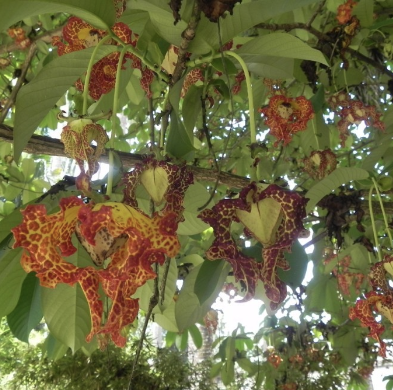

tags:: species
alias:: calabash nutmeg, jamaican nutmeg,

- 
- 
- height: up to 35m
- https://en.wikipedia.org/wiki/Monodora_myristica
- http://www.plantsofasia.com/index/monodora/0-736
- https://www.tokopedia.com/ragamnoorsery/bibit-tanaman-monodora-myristica-1-5-meter-wangi?extParam=ivf%3Dfalse%26src%3Dsearch
-