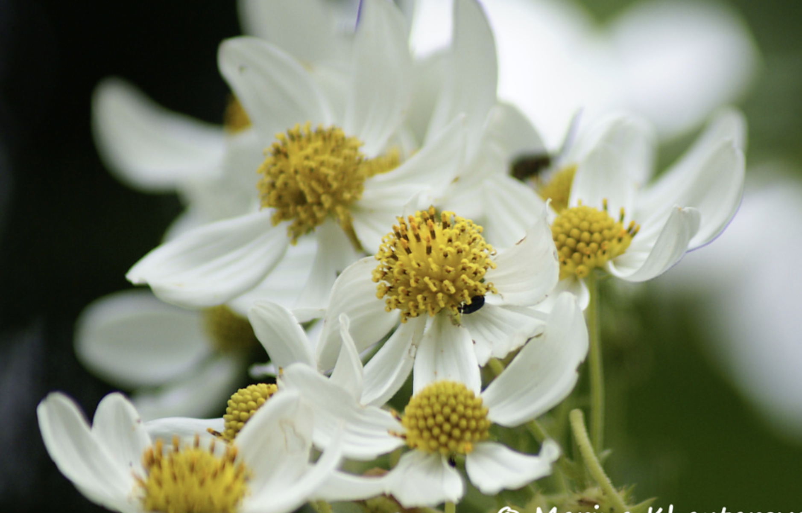

tags:: species
alias:: anzac flower, bush daisy, montanoa, tree daisy

- 
- 
- 
-
- height: 6m
- https://en.wikipedia.org/wiki/Montanoa_hibiscifolia
- http://www.plantsofasia.com/index/montanoa/0-98
- growing at cyber valley
-
-