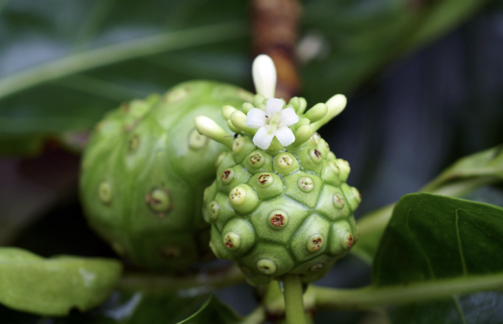
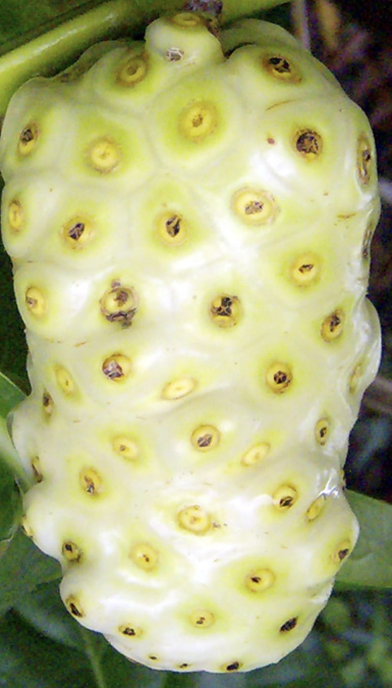

tags:: species
alias:: cheese fruit, noni, mengkudu pace

- 
- 
- 
- height: up to 6m
- https://en.wikipedia.org/wiki/Morinda_citrifolia
- http://www.plantsofasia.com/index/morinda_citrifolia/0-782
- https://tokopedia.com/asitaru/vdb-egrow-10pcs-pack-noni-morinda-citrifolia-pohon-bibit?extParam=ivf%3Dfalse%26src%3Dsearch
-