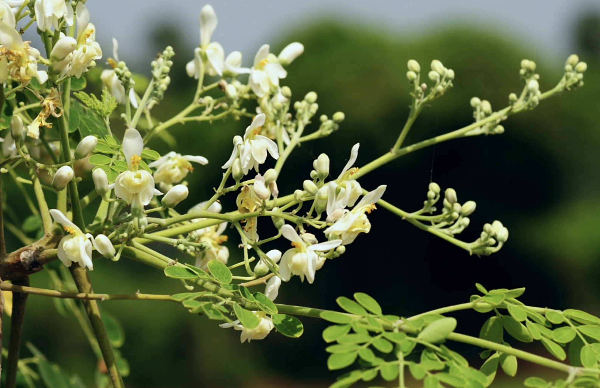

tags:: species
alias:: ben oil tree, moringa, kelor

- 
- 
- 
- [[plant/miracle]]
- {:height 568, :width 840}
- https://www.tokopedia.com/bataviaherbalshop/biji-kelor-kupas-moringa-seeds-kernel-kelor-premium-herbs-time?extParam=ivf%3Dfalse&src=topads
- height: 10-12m
- https://en.wikipedia.org/wiki/Moringa_oleifera
- https://www.tokopedia.com/originalflora/bibit-kelor-pohon-kelor-tanaman-kelor-moringa-oleifera-daun-kelor?extParam=ivf%3Dfalse%26src%3Dsearch
- http://www.plantsofasia.com/index/moringa_oleifera/0-913
-