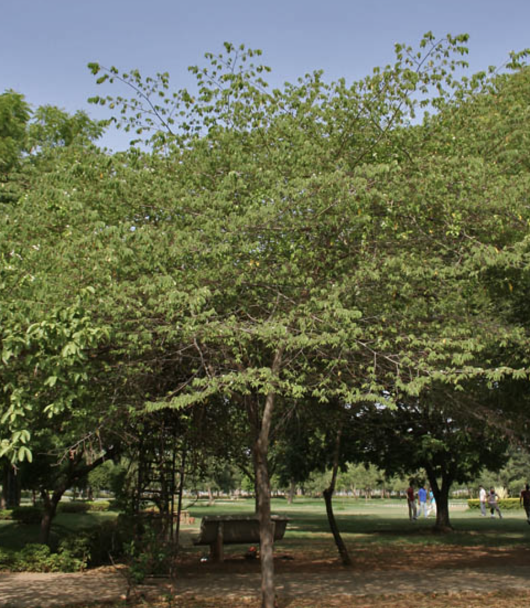
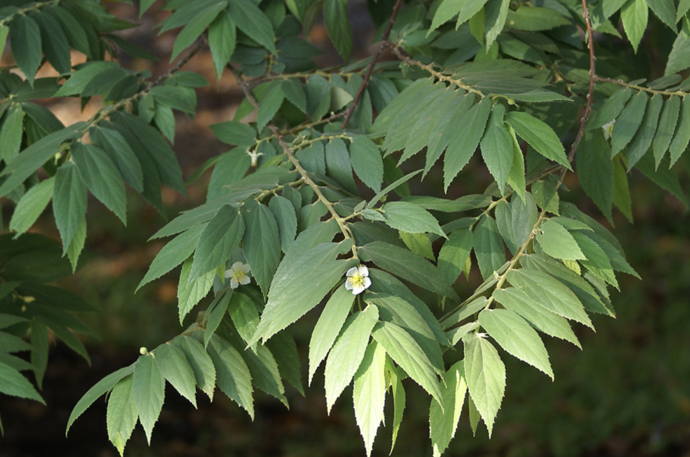
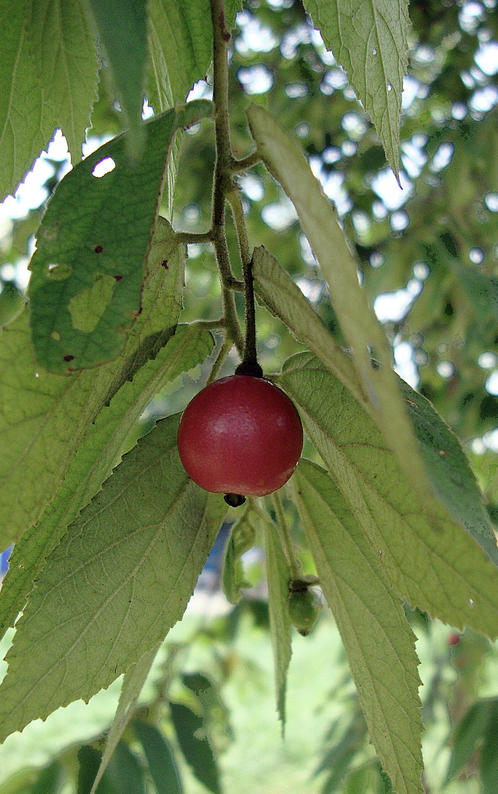

tags:: species
alias::  buah kersen segar

- {:height 1110, :width 962}
- 
- 
- height: 7 - 12 m
- [wiki](https://en.wikipedia.org/wiki/Muntingia)
- [tokopedia example](https://www.tokopedia.com/binmuhsingroup/buah-kersen-tua-segar-talok-ceri-muntingia-calabura?extParam=ivf%3Dfalse%26src%3Dsearch)
- [plants of asia](http://www.plantsofasia.com/index/muntingia/0-101)
-