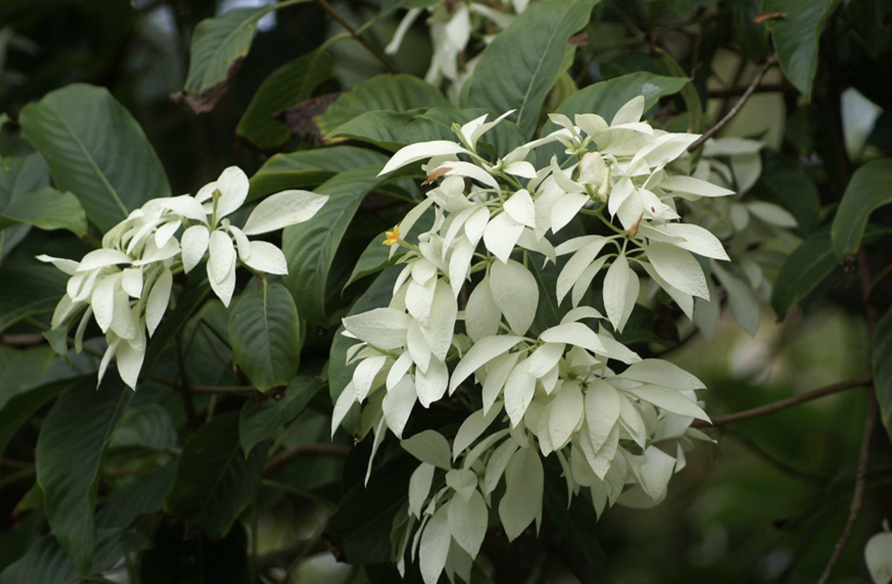
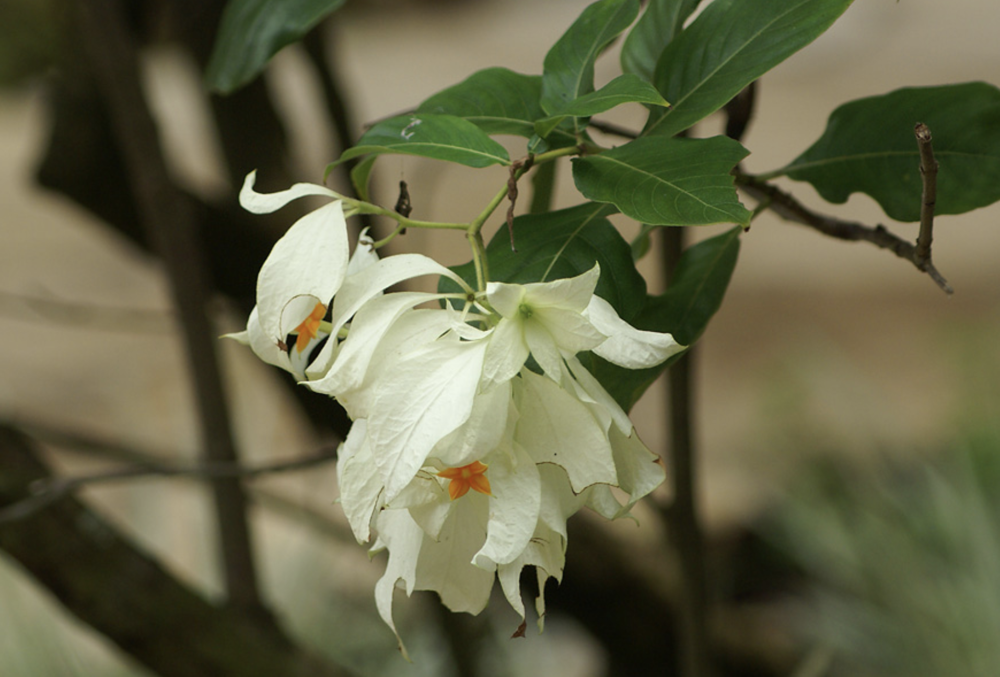

tags:: species
alias:: virgin tree, nusa indah putih

- 
- 
- 
- height: 3m
- https://www.tokopedia.com/sanggarbukit/tanaman-hias-bunga-nusa-indah-mussaenda-40-cm-putih?extParam=ivf%3Dfalse%26src%3Dsearch
- http://www.plantsofasia.com/index/mussaenda_phillipica/0-794
- https://en.wikipedia.org/wiki/Mussaenda_philippica
- [[dona luz]]
- [[mussaenda cv. marmalade]]
-
-