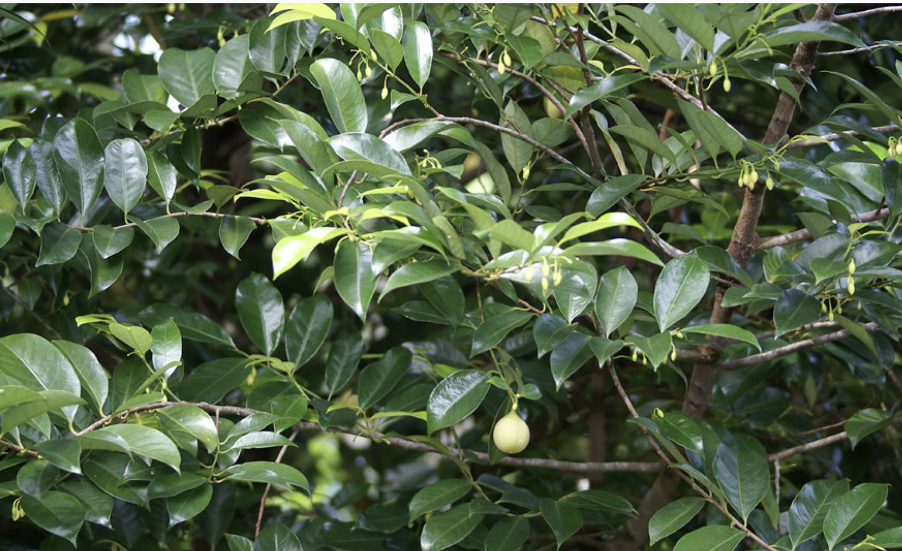
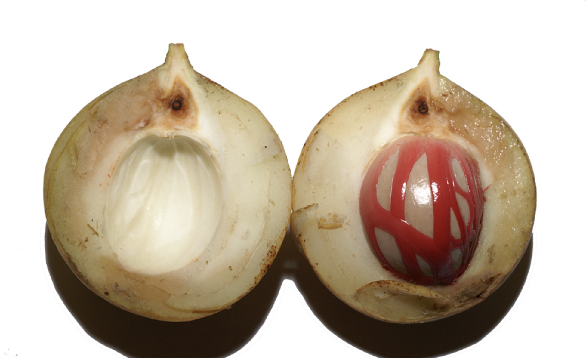

tags:: species
alias:: nutmeg

- 
- 
-
- 
-
- height: 5-15m
- https://en.wikipedia.org/wiki/Myristica_fragrans
- http://www.plantsofasia.com/index/myristica_fragrans/0-1109
- https://www.tokopedia.com/saungbibitbt/bibit-pohon-pala-myristica-fragrans?extParam=ivf%3Dfalse%26src%3Dsearch
-