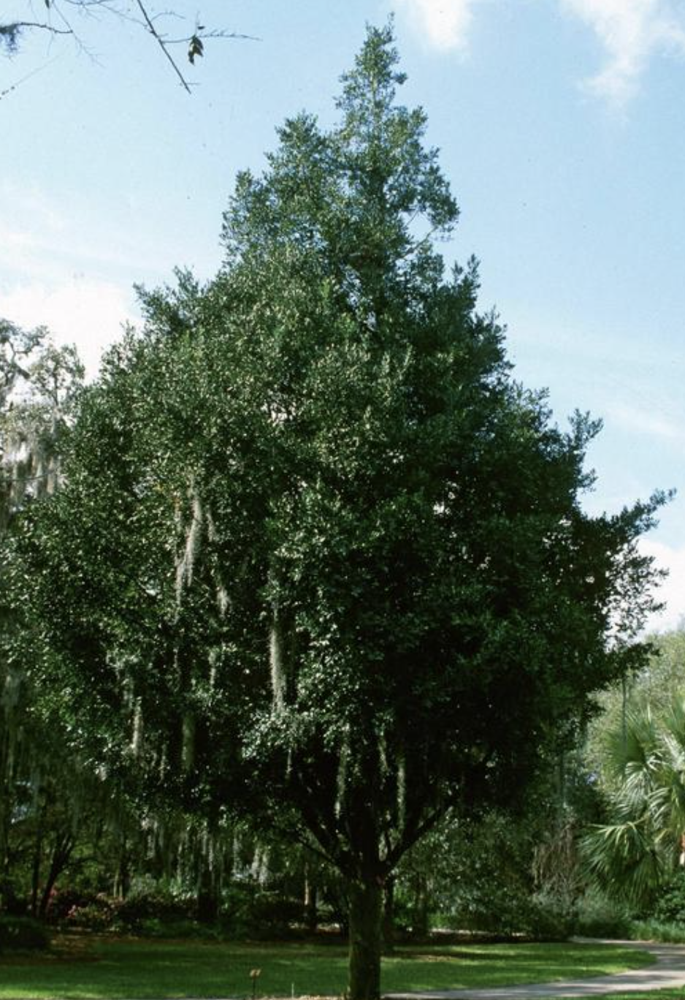

tags:: species
alias:: asian bayberry

- 
- 
- height: up to 25 m
- https://en.wikipedia.org/wiki/Nageia_nagi
- https://www.tokopedia.com/greenmutis/bibit-bonsai-nageia-nagi-variegata-lohansung-nagi?extParam=ivf%3Dfalse%26src%3Dsearch&refined=true
-