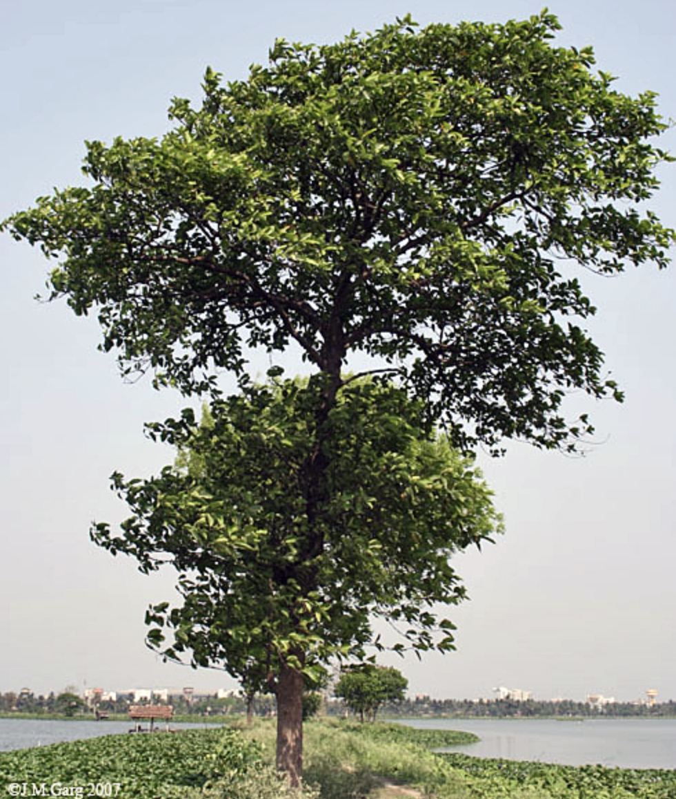
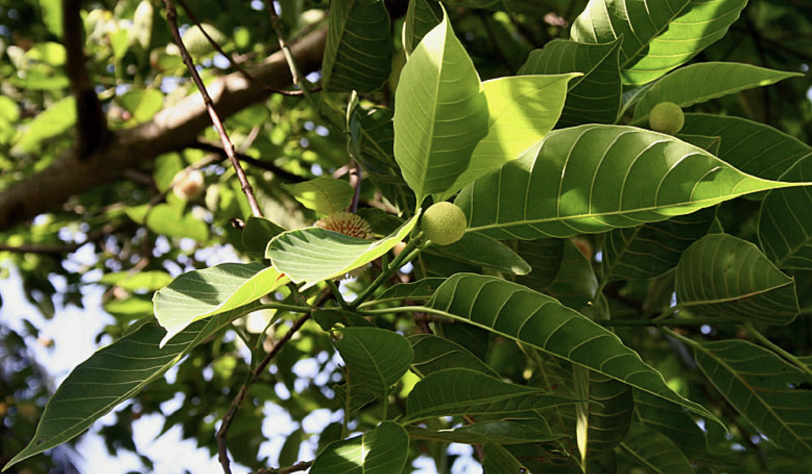

tags:: species
alias:: bur-flower tree, laran, kadam, jabon

- 
- 
- 
- height: up to 45 m
- https://www.tokopedia.com/tanduranid-1/bibit-pohon-jabon-merah?extParam=ivf%3Dfalse%26src%3Dsearch&refined=true
- https://en.wikipedia.org/wiki/Neolamarckia_cadamba
- http://www.plantsofasia.com/index/neolamarckia/0-1274
-
-