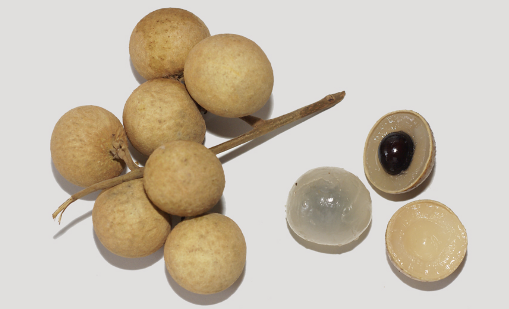

tags:: species
alias:: longan

- 
- 
- height: up to 30 m
- https://en.wikipedia.org/wiki/Longan
- http://www.plantsofasia.com/index/dimocarpus_longan/0-596
- https://www.tokopedia.com/hanaranurseries/nephelium-longana-puangray-lengkeng-puangray-pohon-instan?extParam=ivf%3Dfalse%26src%3Dsearch
-