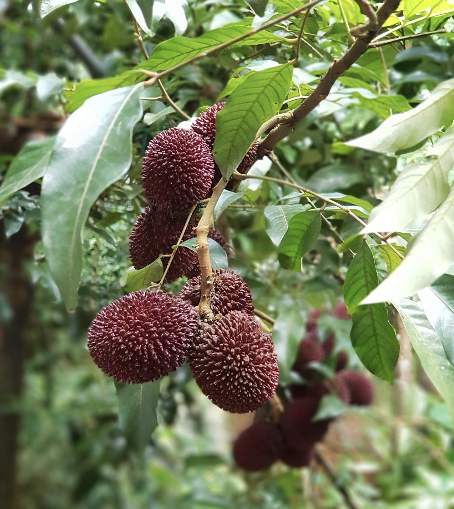
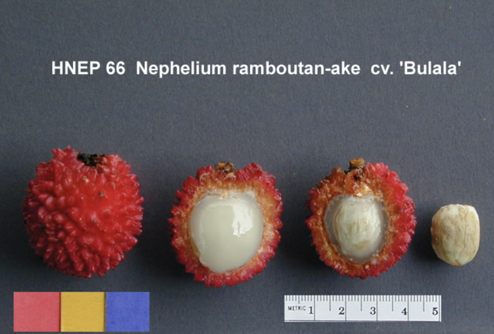

tags:: species
alias:: pulasan, kapulasan

- 
- 
- height: 10-15 m
- https://en.wikipedia.org/wiki/Pulasan
- http://www.plantsofasia.com/index/nephelium_ramboutan_ake/0-908
- https://www.tokopedia.com/velvetcanyon7439/rame-bibit-rambutan-kapulasan-super-cepat-buah?extParam=ivf%3Dfalse%26src%3Dsearch&refined=true
-