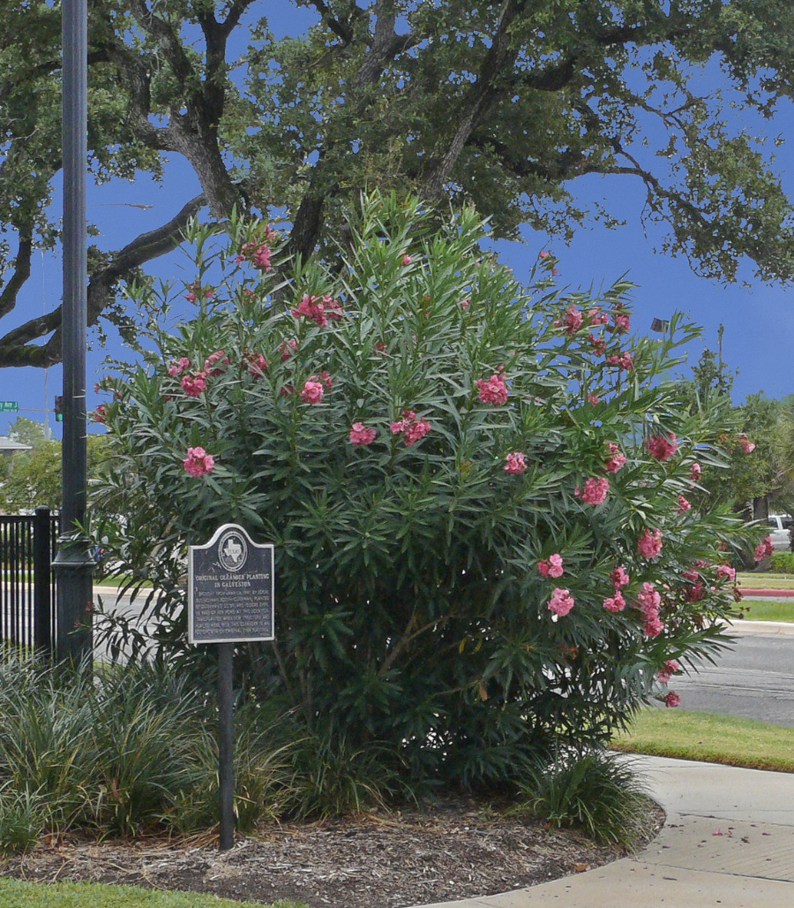

tags:: species
alias:: oleander, rose bay, bunga jepun

- 
- {:height 506, :width 630}
- 
- 
- 
- 
- height: 2-6 m
- http://www.plantsofasia.com/index/nerium_oleander/0-618
- https://en.wikipedia.org/wiki/Nerium
- https://www.tokopedia.com/jovitta/nerium-oleander-bunga-jepun-jpun-mentega-tanaman-hias-bibit-2030?extParam=ivf%3Dfalse%26src%3Dsearch
-