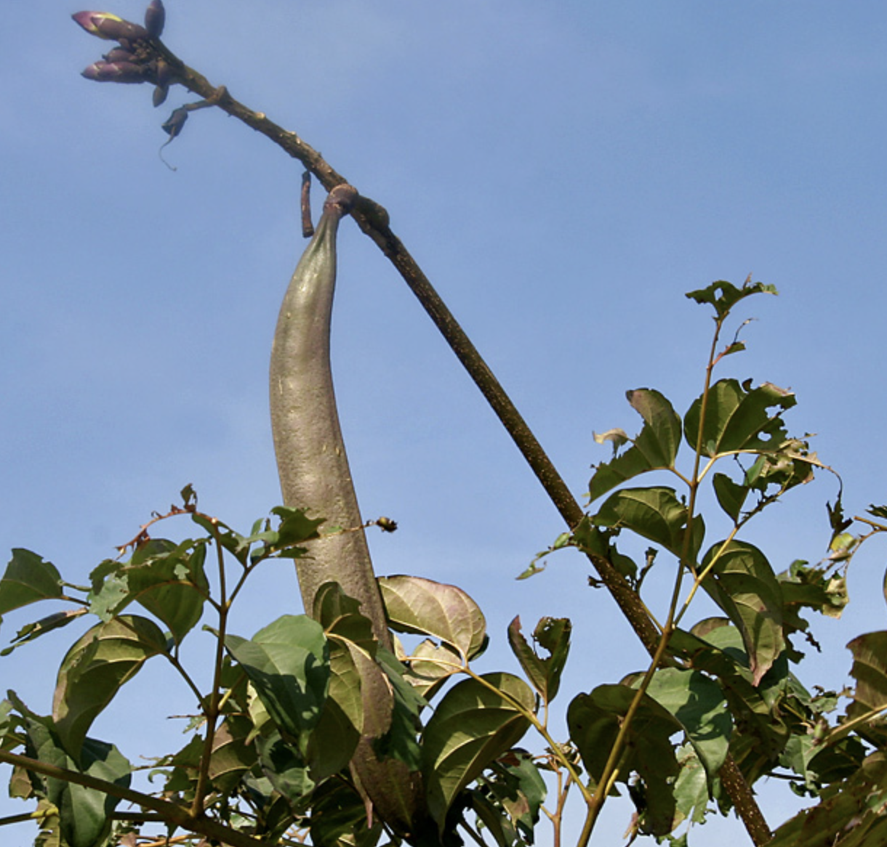

tags:: species
alias:: broken bones, damocles tree, bungli

- 
- 
- 
- height: 12m
- https://en.wikipedia.org/wiki/Oroxylum_indicum
- http://www.plantsofasia.com/index/oroxylum/0-583
- https://www.tokopedia.com/toserbitokoserbaserb1/50gr-qian-zhang-zhi-indian-trumetflower-seed-bungli?extParam=ivf%3Dfalse%26src%3Dsearch&refined=true
- why damocles?
	- is a figure from ancient greek mythology and legend, best known for the anecdote the sword of damocles
	- story is often used to illustrate the idea that those in positions of power live with the constant threat of danger and that their apparent happiness and wealth come with significant risks and responsibilities
	- the tale goes as follows
	- damocles was a courtier in the court of Dionysius II, a tyrant of Syracuse in Sicily
	- he flatteringly exclaimed that dionysius was truly fortunate to be surrounded by such magnificence and wealth
	- In response, Dionysius offered to switch places with Damocles for a day to let him experience the luxury firsthand
	- Damocles eagerly accepted and was seated at a lavish banquet, enjoying all the splendor and opulence of the ruler's life.
	- However, Dionysius had arranged for a sharp sword to be suspended above the throne by a single horsehair, which could snap at any moment. When Damocles saw the precarious sword, he could no longer enjoy the pleasures of the banquet and asked to be relieved of his new position, having learned that with great power comes great peril.
	- The story of Damocles highlights the themes of the fragility of happiness, the ever-present threat to those in power, and the inherent dangers that come with a life of luxury and authority.