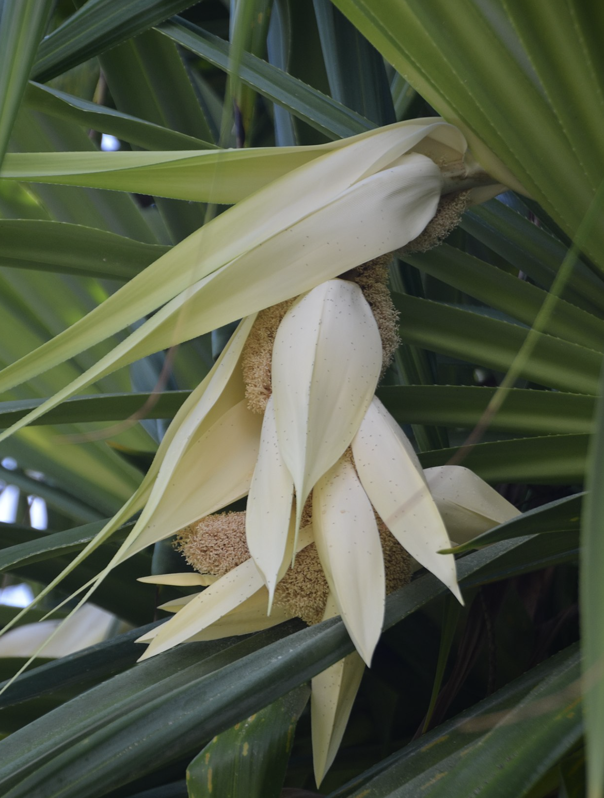

tags:: species
alias:: pandan, pandanus palm, screw pine

- 
- 
- 
- height: 4-14m
- http://www.plantsofasia.com/index/pandanus/0-727
- https://en.wikipedia.org/wiki/Pandanus_tectorius
- https://www.tokopedia.com/ptlandscape/tanaman-hias-pandanus-tectorius-dengan-pot?extParam=ivf%3Dfalse%26src%3Dsearch