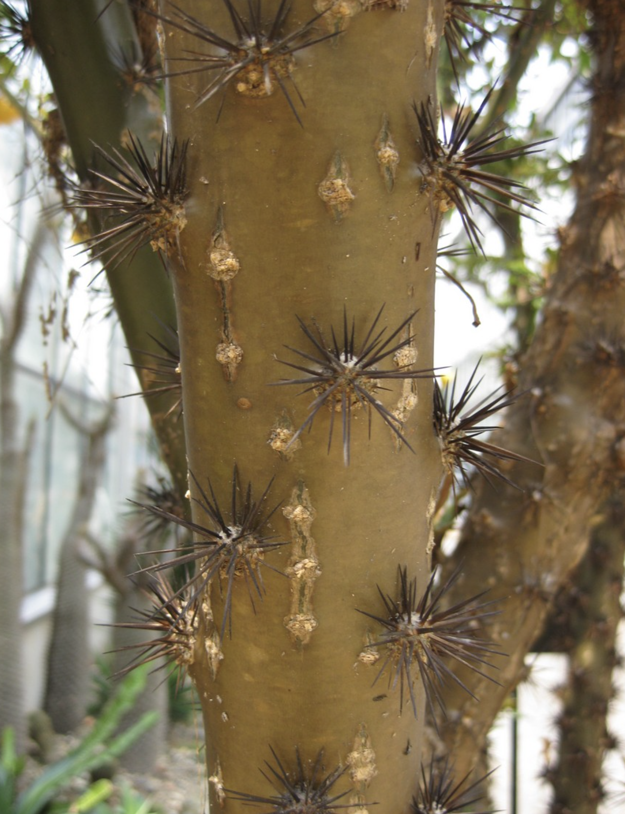

tags:: species
alias:: bleo, leaf cactus, bunga tujuh duri

- 
- 
- 
- height: 2-8m
- http://www.plantsofasia.com/index/pereskia_bleo/0-585
- https://en.wikipedia.org/wiki/Leuenbergeria_bleo
- https://www.tokopedia.com/es-craft/bibit-bunga-tujuh-duri-jarum-tujuh-bilah-pereskia-bleo-pereskia?extParam=ivf%3Dfalse%26src%3Dsearch&refined=true
-
-