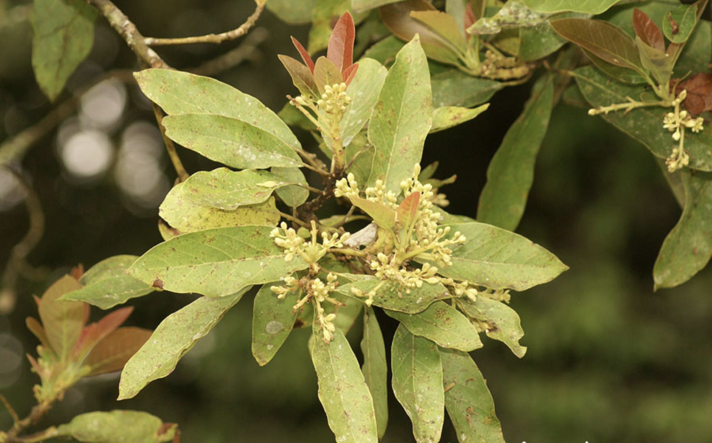

tags:: species
alias:: avocado, alpukat

- 
- height: 10m
- https://en.wikipedia.org/wiki/Avocado
- https://www.tokopedia.com/wijaya-agro/bibit-alpukat-non-biji-persea-americana?extParam=ivf%3Dfalse%26src%3Dsearch
- http://www.plantsofasia.com/index/persea/0-335
- Avocado varieties with Type A flowers open their female bits in the morning of Day One and their male parts in Day Two’s afternoon, while those with Type B flowers open their female parts in the afternoon of Day One and their male parts in the morning of Day Two.
- Each opening only lasts for about half a day.
- This behavior, known as “protogynous dichogamy,” encourages the cross-pollination and genetic diversity that leads to more robust organisms.
- 
- 
- 
- https://wikifarmer.com/all-avocado-varieties-explained-characteristics-and-advantages/
- 
- 
- optical observations
	- The change of color of the pile:
	- in dark varieties like Hass from green to black-purple
	- in green varieties, the fruit stem turns yellow, and the skin may appear less shiny (powdery appearance) with rust-like spots
	- By harvesting a few fruits and storing them at room temperature for 7-10 days. If they soften without shriveling and taste as expected, the fruit is ready for harvesting. We use this technique for Zutano and Fuerte that keep their green color even when they mature.