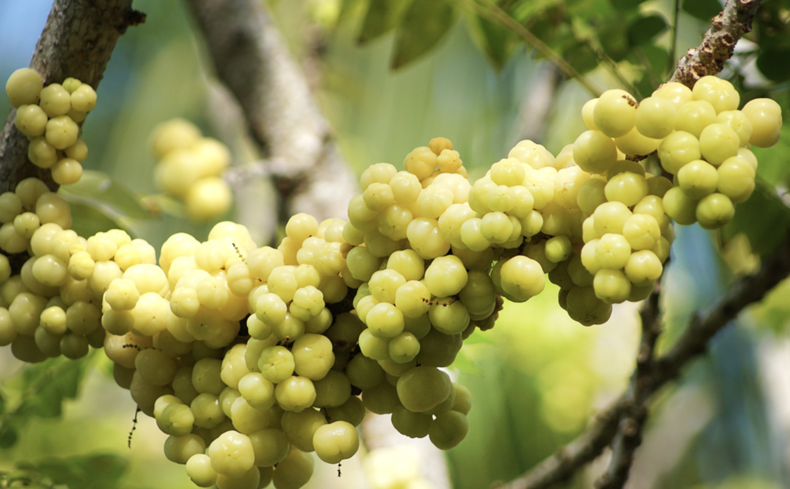

tags:: species
alias:: gooseberry tree, ceremai

- 
- 
- height: 2-9 m
- http://www.plantsofasia.com/index/phyllanthus_acidus/0-1160
- https://en.wikipedia.org/wiki/Phyllanthus_acidus
- https://www.tokopedia.com/pansaterra/tanaman-buah-pohon-cermai-star-gooseberry-phyllanthus-acidus?extParam=ivf%3Dfalse%26src%3Dsearch
-