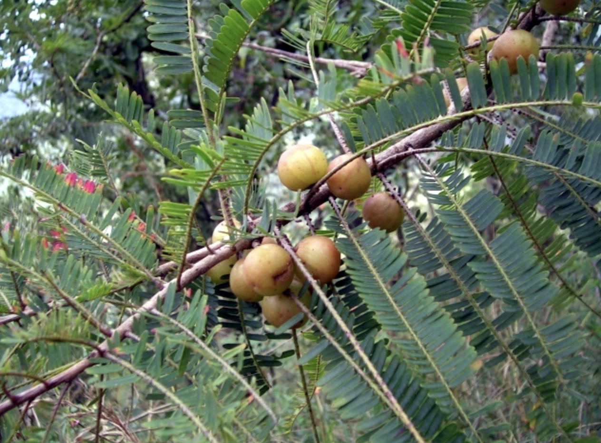

tags:: species
alias:: emblic, myrobalan, malaka

- 
- 
- height: 1-8m
- http://www.plantsofasia.com/index/phyllanthus_emblica/0-1354
- https://en.wikipedia.org/wiki/Phyllanthus_emblica
- https://www.tokopedia.com/agropurworejo/bibit-tanaman-malaka-kemloko-amla-buah-tinggi-anti-oksidan-dan-vit-c?extParam=ivf%3Dfalse%26src%3Dsearch
-