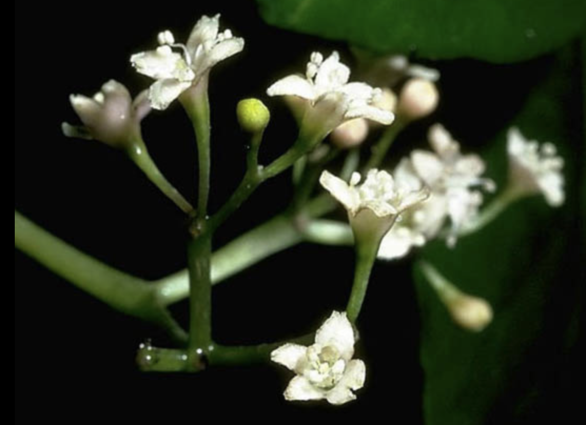

tags:: species
alias:: ceodes umbellifera, birdlime tree, bird catcher tree

- 
- 
- 
- height: 4-12m
- https://en.wikipedia.org/wiki/Ceodes_umbellifera
- https://www.tokopedia.com/hera-store-17/tanaman-hias-pisonia-umbellifera?extParam=ivf%3Dfalse%26src%3Dsearch&refined=true
-