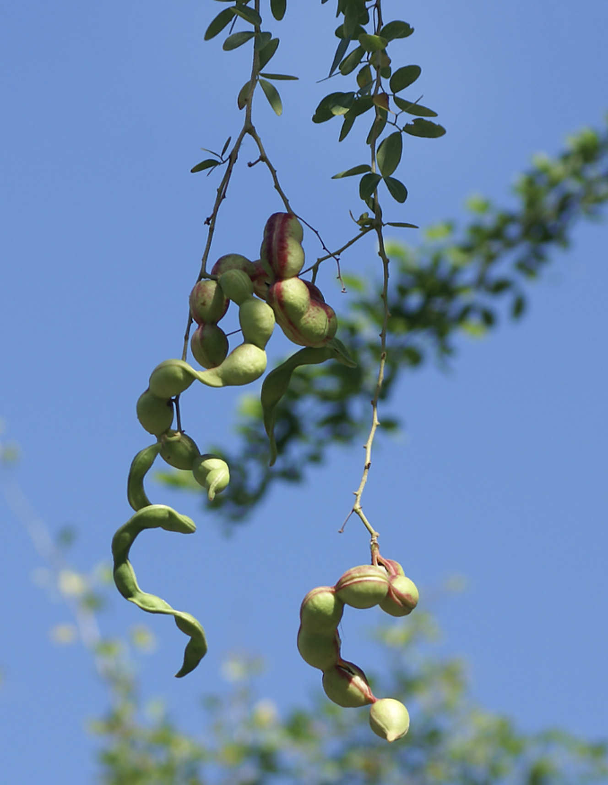

tags:: species
alias:: madras thorn, manila tamarind, asam belanda

- nitrogener:: 70
- 
- height: 10-15m
- http://www.plantsofasia.com/index/pithecellobium_dulce/0-640
- https://en.wikipedia.org/wiki/Pithecellobium_dulce
- https://www.tokopedia.com/victoryseed/biji-asem-asam-manila-tamarind-londo-belanda-pithecellobium-dulce?extParam=ivf%3Dfalse%26src%3Dsearch
-