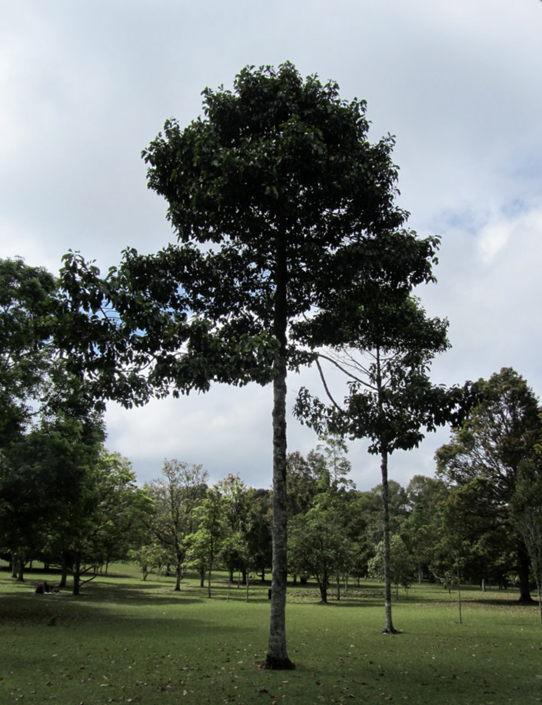
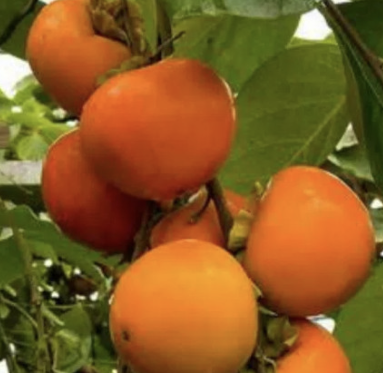

tags:: species
alias:: badut, kadut

- 
- 
- height: up to 30 m
- http://www.plantsofasia.com/index/planchonella_duclitan/0-1084
- https://www.tokopedia.com/tumbasbi/bibit-tanaman-buah-kesemek-buah-badut?extParam=ivf%3Dfalse%26src%3Dsearch
- https://en.wikipedia.org/wiki/Planchonella_duclitan
-