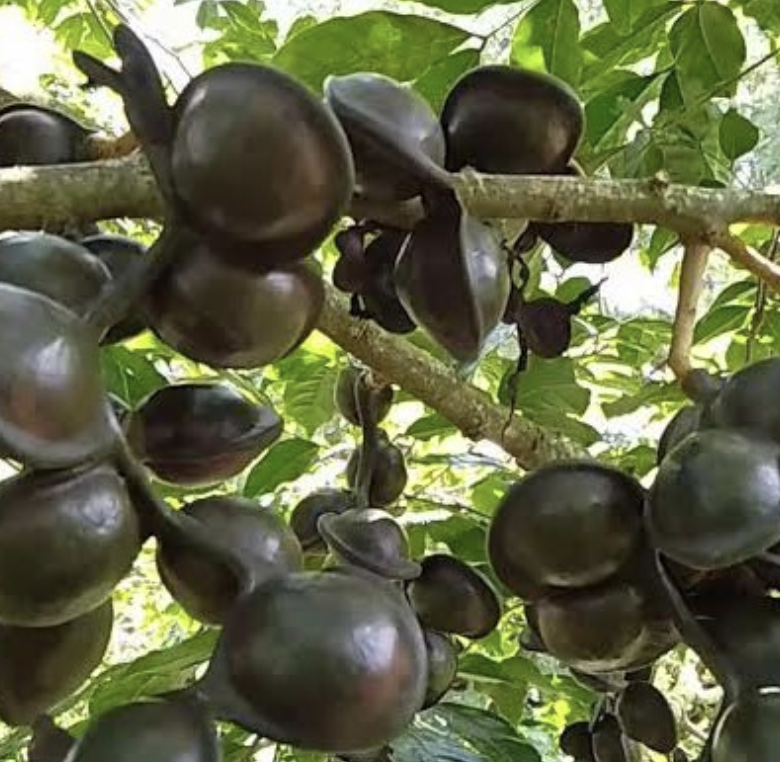

tags:: species
alias:: northern yellow boxwood, sea gutta

- 
- 
- height: up to 20m
- https://en.wikipedia.org/wiki/Planchonella_obovata
- http://www.plantsofasia.com/index/planchonella_obovata/0-1051
- https://www.tokopedia.com/areatani/bibit-jengkol-super-okulasi-unggulan?extParam=ivf%3Dfalse%26src%3Dsearch&refined=true
-