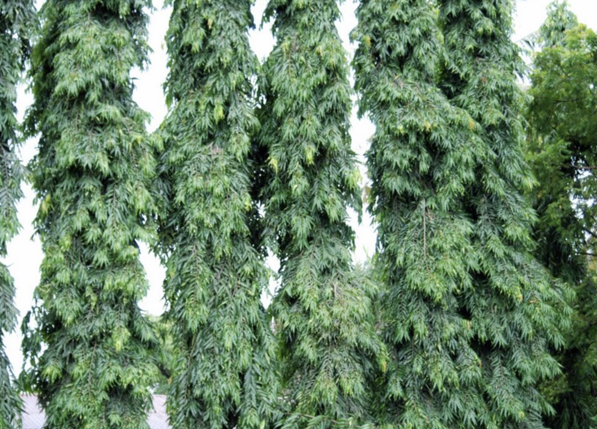

tags:: species
alias:: monoon longifolium, false ashoka

- 
- height: up to 20 m
- https://en.wikipedia.org/wiki/Monoon_longifolium
- https://www.tokopedia.com/emperanomah/grosir-bibit-tanaman-pohon-glodokan-tiang-polyalthia-longifolia?extParam=ivf%3Dfalse%26src%3Dsearch
-