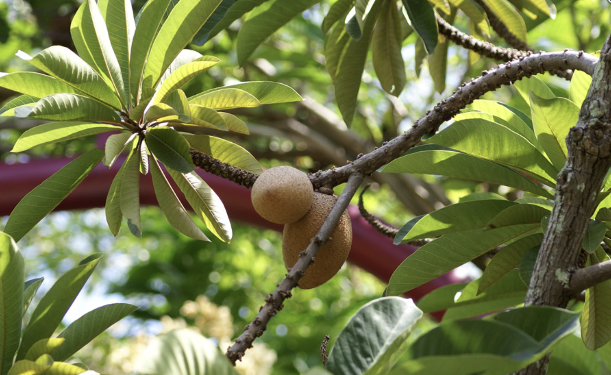
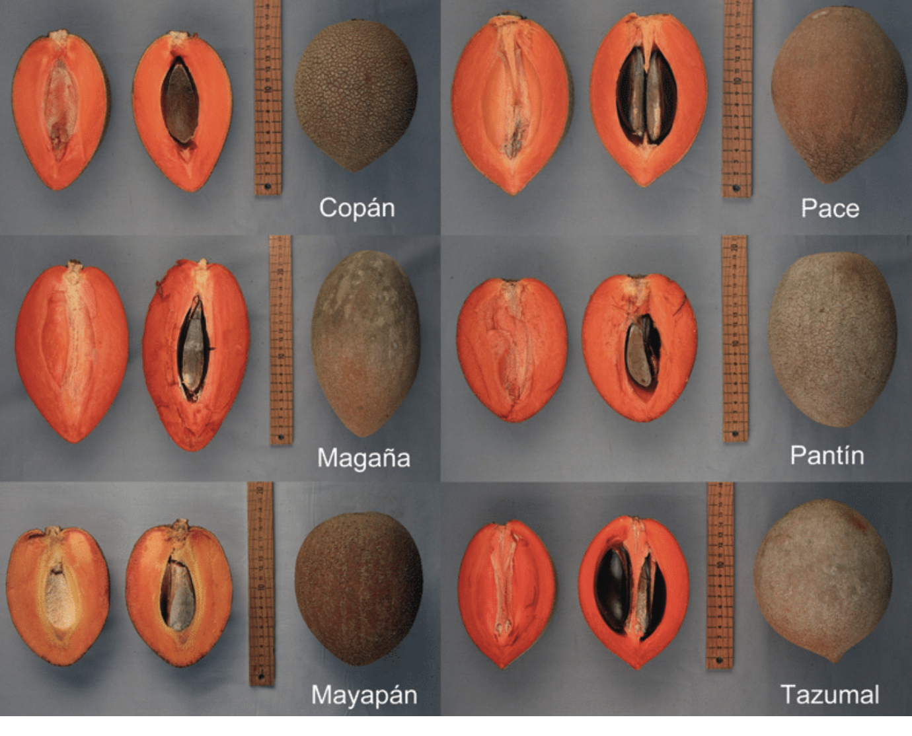

tags:: species
alias:: mamey sapote, marmalade fruit

- 
- height: up to 20 m
- https://en.wikipedia.org/wiki/Planchonella_obovata
- http://www.plantsofasia.com/index/pouteria_sapota/0-1008
- https://www.tokopedia.com/tebuwulung/bibit-mamey-sapote-magana-cangkok?extParam=ivf%3Dfalse%26src%3Dsearch
- {:height 1008, :width 1000}
- 
- 