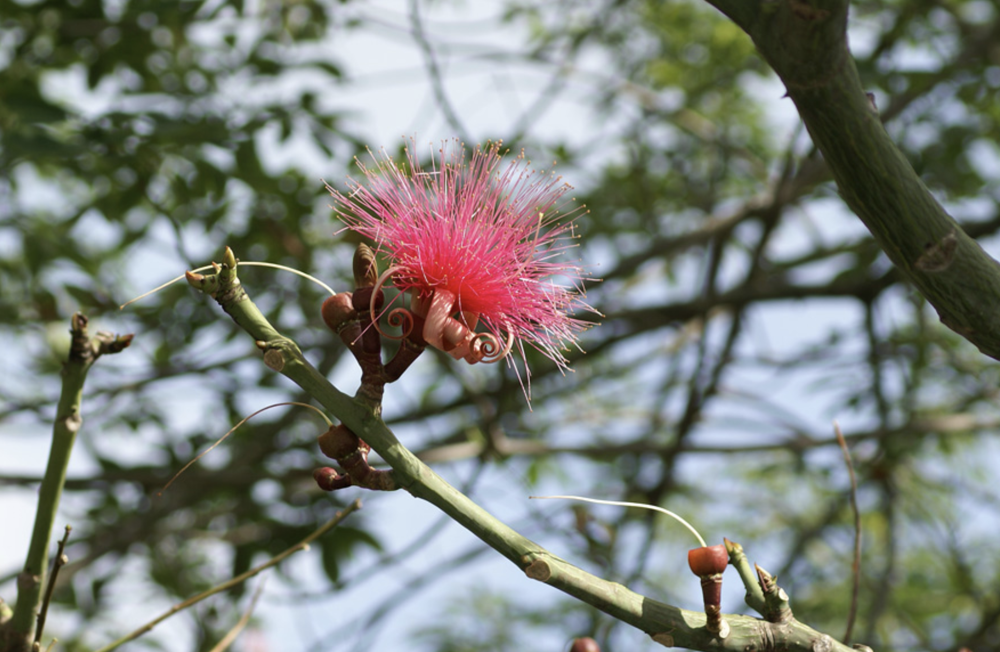
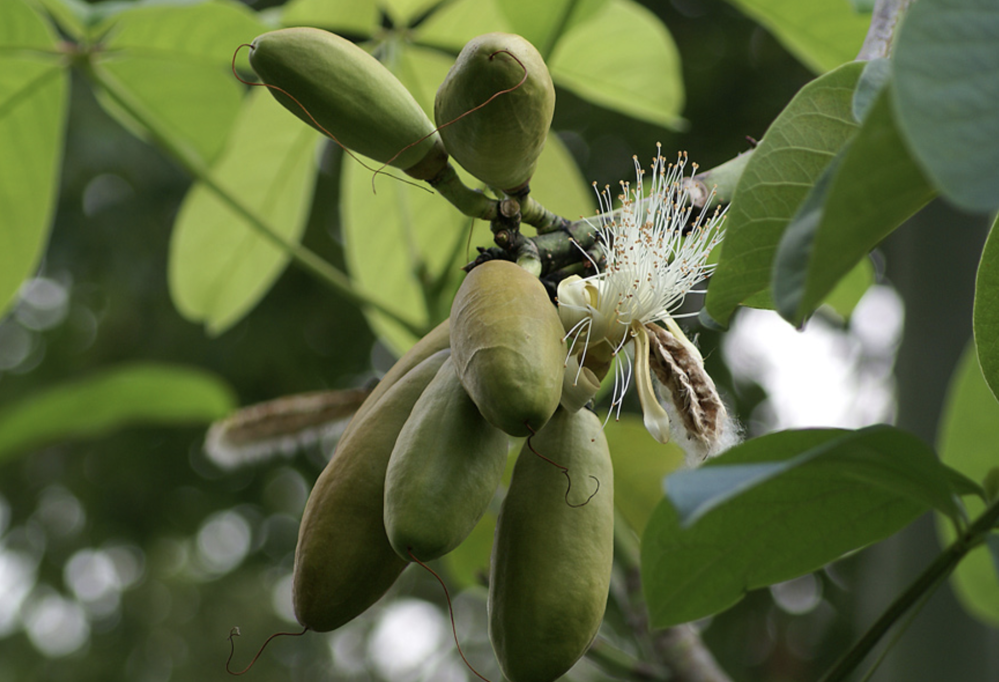

tags:: species
alias:: shaving brush tree

- 
- 
- 
- height: up to 18 m
- https://en.wikipedia.org/wiki/Pseudobombax_ellipticum
- http://www.plantsofasia.com/index/pseudobombax_ellipticum/0-864
- https://www.tokopedia.com/popplantid/pseudobombax-ellipticum-seedling?extParam=ivf%3Dfalse%26src%3Dsearch
-