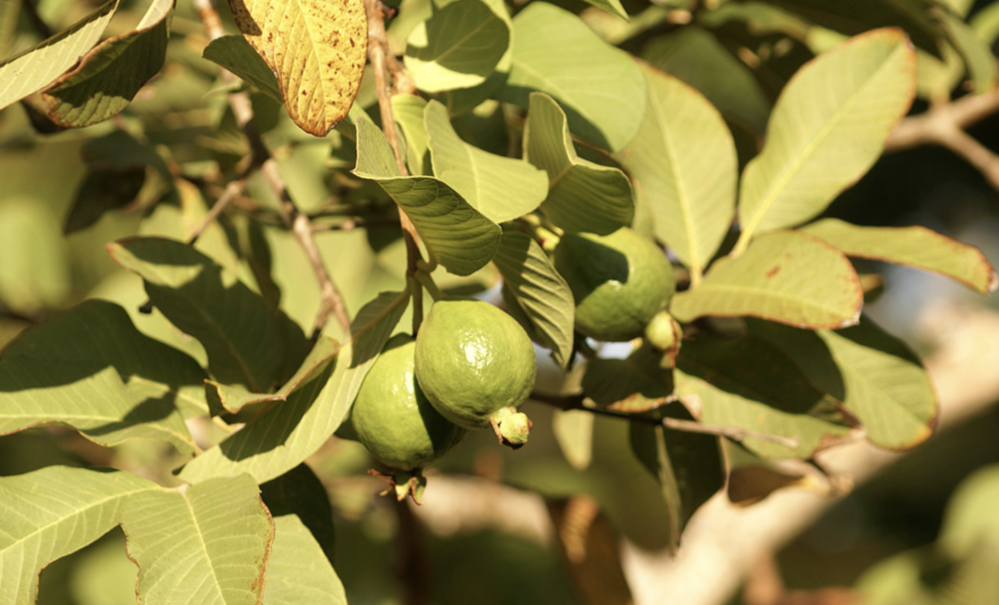

tags:: species
alias:: guava, jambu batu

- 
- height: up to 10 m
- http://www.plantsofasia.com/index/psidium/0-336
- https://en.wikipedia.org/wiki/Psidium_guajava
- https://www.tokopedia.com/maiyahflorist/bibit-tanaman-buah-jambu-kerikil-psidium-guajava?extParam=ivf%3Dfalse%26src%3Dsearch
-